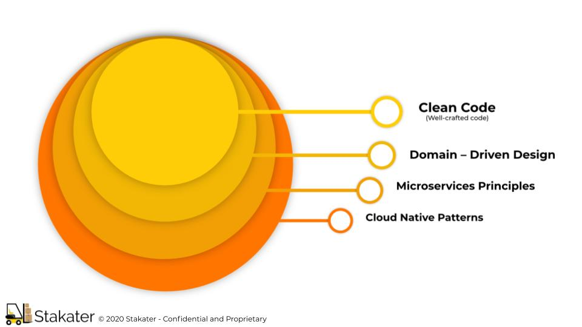
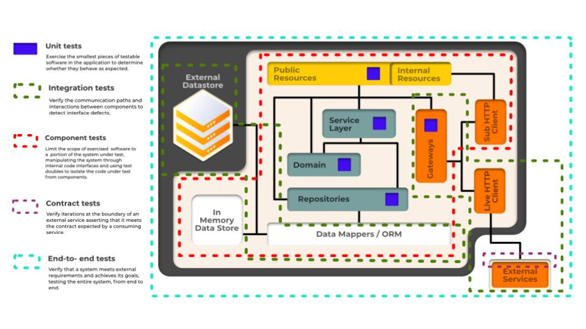

# DNA of Kubernetes Apps

Whether you are building new applications for the Kubernetes or seeking to migrate existing applications, DNA of Kubernetes Native App is an essential guide that should be on the shelf of every developer and architect targeting the Kubernetes.

## The Path to Cloud Native

The most popular application architecture on the cloud-native platforms such as Kubernetes is the microservices style. This software development technique tackles software complexity through modularization of business capabilities and trading development complexity for operational complexity.

As part of the microservices movement, there is a significant amount of theory and supplemental techniques for creating microservices from scratch or for splitting monoliths into microservices. Most of these practices are based on the Domain Driven Design book by Eric Evans (Addison-Wesley) and the concepts of bounded contexts and aggregates. Bounded contexts deal with large models by dividing them into different components, and aggregates help further to group bounded contexts into modules with defined transaction boundaries. However, in addition to these business domain considerations, for every distributed system—whether it is based on microservices or not—there are also numerous technical concerns around its organization, structure, and runtime behavior.

Containers and container orchestrators such as Kubernetes provide many new primitives and abstractions to address the concerns of distributed applications, and here we discuss the various options to consider when putting a distributed system into Kubernetes. 

Containers and cloud-native platforms bring tremendous benefits to your distributed applications, but if all you put into containers is rubbish, you will get distributed rubbish at scale. Figure below shows the mixture of the skills required for creating good cloud-native applications.



At a high level, there are multiple abstraction levels in a cloud-native application that require different design considerations:

- At the lowest code level, every variable you define, every method you create, and every class you decide to instantiate plays a role in the long-term maintenance of the application. No matter what container technology and orchestration platform you use, the development team and the artifacts they create will have the most impact. It is important to grow developers who strive to write clean code, have the right amount of automated tests, constantly refactor to improve code quality, and are software craftsmen at heart.

- Domain-Driven Design is about approaching software design from a business perspective with the intention of keeping the architecture as close to the real world as possible. This approach works best for object-oriented programming languages, but there are also other good ways to model and design software for real-world problems. A model with the right business and transaction boundaries, easy-to-consume interfaces, and rich APIs is the foundation for successful containerization and automation later.

- The microservices architectural style very quickly evolved to become the norm, and it provides valuable principles and practices for designing changing distributed applications. Applying these principles lets you create implementations that are optimized for scale, resiliency, and pace of change, which are common requirements for any modern software today.

- Containers were very quickly adopted as the standard way of packaging and running distributed applications. Creating modular, reusable containers that are good cloud-native citizens is another fundamental prerequisite. With a growing number of containers in every organization comes the need to manage them using more effective methods and tools. Cloud native is a relatively new term used to describe principles, patterns, and tools to automate containerized microservices at scale. We use cloud native interchangeably with Kubernetes, which is the most popular open source cloud-native platform available today.

This document describes the following facets of kubernetes-native applications:

1. One codebase, one application
2. Dependency management
3. Contract first, API first
4. Design, build, release, and run
5. Configuration, credentials, and code
6. Liveness and readiness probes
7. Logging
8. Backing services
9. Telemetry / Metric instrumentation
10. Graceful Shutdown
11. Port binding
12. Stateless processes
13. Concurrency
14. Environment parity
15. Authentication and authorization
16. Dependencies initialization
17. Disposability
18. Declarative Syntax to Manage Kubernetes State
19. Secrets handling
20. Tracing instrumentation
21. Administrative processes
22. Requests & limits
23. Alerts
24. Backup & restore (optional)
25. Certificates (optional)
26. Forecastle (optional)
27. Grafana Dashboard (optional)
28. Multiple replicas
29. Important state does not persist in container filesystem
30. Testing

## 1. One codebase, one application

### What?

When managing myriad aspects of a development team, the organization of code, artifacts, and other apparent minutia is often considered a minor detail or outright neglected. However, proper application of discipline and organization can mean the difference between a one-month production lead time and a one-day lead time.

Cloud-native applications must always consist of a single codebase that is tracked in a version control system. A codebase is a source code repository or a set of repositories that share a common root.

The single codebase for an application is used to produce any number of immutable releases that are destined for different environments. Following this particular discipline forces teams to analyze the seams of their application and potentially identify monoliths that should be split off into microservices. If you have multiple codebases, then you have a system that needs to be decomposed, not a single application.

The simplest example of violating this guideline is where your application is actually made of up a dozen or more source code repositories. This makes it nearly impossible to automate the build and deploy phases of your application’s life cycle.

Another way this rule is often broken is when there is a main application and a tightly coupled worker (or an en-queuer and dequeuer, etc.) that collaborate on the same units of work. In scenarios like this, there are actually multiple codebases supporting a single application, even if they share the same source repository root. This is why I think it is important to note that the concept of a codebase needs to imply a more cohesive unit than just a repository in your version control system.

Conversely, this rule can be broken when one codebase is used to produce multiple applications. For example, a single codebase with multiple launch scripts or even multiple points of execution within a single wrapper module. In the Java world, EAR files are a gateway drug to violating the one codebase rule. In the interpreted language world (e.g., Ruby), you might have multiple launch scripts within the same codebase, each performing an entirely different task.

Multiple applications within a single codebase are often a sign that multiple teams are maintaining a single codebase, which can get ugly for a number of reasons. Conway’s law states that the organization of a team will eventually be reflected in the architecture of the product that team builds. In other words, dysfunction, poor organization, and lack of discipline among teams usually results in the same dysfunction or lack of discipline in the code.

In situations where you have multiple teams and a single codebase, you may want to take advantage of Conway’s law and dedicate smaller teams to individual applications or microservices.

When looking at your application and deciding on opportunities to reorganize the codebase and teams onto smaller products, you may find that one or more of the multiple codebases contributing to your application could be split out and converted into a microservice or API that can be reused by multiple applications.

In other words, one codebase, one application does not mean you’re not allowed to share code across multiple applications; it just means that the shared code is yet another codebase.

This also doesn’t mean that all shared code needs to be a microservice. Rather, you should evaluate whether the shared code should be considered a separately released product that can then be vendored into your application as a dependency.

### Why?

Makes it nearly impossible to automate the build and deploy phases of your application’s life cycle.

### How?

One Application == One Microserivce == One Git/SCM Repository

## 2. Dependency management

### What?

Management of application dependencies: how, where, and when they are managed.

A cloud-native application never relies on implicit existence of system-wide packages. For Java, this means that your applications cannot assume that a container will be managing the classpath on the server. For .NET, this means that your application cannot rely on facilities like the Global Assembly Cache. Ruby developers cannot rely on gems existing in a central location. Regardless of language, your code cannot rely on the pre-existence of dependencies on a deployment target.

### Why?

Not properly isolating dependencies can cause untold problems. In some of the most common dependency-related problems, you could have a developer working on version X of some dependent library on his workstation, but version X+1 of that library has been installed in a central location in production. This can cause everything from runtime failures all the way up to insidious and difficult to diagnose subtle failures. If left untreated, these types of failures can bring down an entire server or cost a company millions through undiagnosed data corruption.

Properly managing your application’s dependencies is all about the concept of repeatable deployments. Nothing about the runtime into which an application is deployed should be assumed that isn’t automated. In an ideal world, the application’s container is bundled (or bootstrapped, as some frameworks called it) inside the app’s release artifact—or better yet, the application has no container at all.

However, for some enterprises, it just isn’t practical (or possible, even) to embed a server or container in the release artifact, so it has to be combined with the release artifact, which, in many cloud environments like Heroku or Cloud Foundry, is handled by something called a buildpack.

Applying discipline to dependency management will bring your applications one step closer to being able to thrive in cloud environments.

### How?

Most contemporary programming languages have some facility for managing application dependencies. Maven and Gradle are two of the most popular tools in the Java world, while NuGet is popular for .NET developers, Bundler is popular for Ruby, and godeps is available for Go programmers. Regardless of the tool, these utilities all provide one set of common functionality: they allow developers to declare dependencies and let the tool be responsible for ensuring that those dependencies are satisfied.

Many of these tools also have the ability to isolate dependencies. This is done by analyzing the declared dependencies and bundling (also called vendoring) those dependencies into some sub-structure beneath or within the application artifact itself.

## 3. Contract first, API first

### What?

Recognize your API as a first-class artifact of the development process, API first gives teams the ability to work against each other’s public contracts without interfering with internal development processes.

### Why?

Even if you’re not planning on building a service as part of a larger ecosystem, the discipline of starting all of your development at the API level still pays enough dividends to make it worth your time.

Built into every decision you make and every line of code you write is the notion that every functional requirement of your application will be met through the consumption of an API. Even a user interface, be it web or mobile, is really nothing more than a consumer of an API.

By designing your API first, you are able to facilitate discussion with your stakeholders (your internal team, customers, or possibly other teams within your organization who want to consume your API) well before you might have coded yourself past the point of no return. This collaboration then allows you to build user stories, mock your API, and generate documentation that can be used to further socialize the intent and functionality of the service you’re building.

There is absolutely no excuse for claiming that API first is a difficult or unsupported path. This is a pattern that can be applied to noncloud software development, but it is particularly well suited to cloud development in its ability to allow rapid prototyping, support a services ecosystem, and facilitate the automated deployment testing and continuous delivery pipelines that are some of the hallmarks of modern cloud-native application development.

This pattern is an extension of the contract-first development pattern, where developers concentrate on building the edges or seams of their application first. With the integration points tested continuously via CI servers, teams can work on their own services and still maintain reasonable assurance that everything will work together properly.

API first frees organizations from the waterfall, deliberately engineered system that follows a preplanned orchestration pattern, and allows products to evolve into organic, self-organizing ecosystems that can grow to handle new and unforeseen demands.

### How?

Live, eat, and breathe the API-first lifestyle, and your investment will pay off exponentially.

Stakater App Agility Platform offers a fully managed 3Scale API Gateway add-on to manage the entire lifecycle of your APIs from design, to build, to publish.

## 4. Design, build, release, and run

### What?

#### Desgin

In the world of waterfall application development, we spend an inordinate amount of time designing an application before a single line of code is written. This type of software development life cycle is not well suited to the demands of modern applications that need to be released as frequently as possible.

However, this doesn’t mean that we don’t design at all. Instead, it means we design small features that get released, and we have a high-level design that is used to inform everything we do; but we also know that designs change, and small amounts of design are part of every iteration rather than being done entirely up front.

The application developer best understands the application dependencies, and it is during the design phase that arrangements are made to declare dependencies as well as the means by which those dependencies are vendored, or bundled, with the application. In other words, the developer decides what libraries the application is going to use, and how those libraries are eventually going to be bundled into an immutable release.

#### Build

The build stage is where a code repository is converted into a versioned, binary artifact. It is during this stage that the dependencies declared during the design phase are fetched and bundled into the build artifact (often just simply called a “build”). In the Java world, a build might be a WAR1 or a JAR file, or it could be a ZIP file or a binary executable for other languages and frameworks.

Builds are ideally created by a Continuous Integration server, and there is a 1:many relationship between builds and deployments. A single build should be able to be released or deployed to any number of environments, and each of those unmodified builds should work as expected. The immutability of this artifact and adherence to the other factors (especially environment parity) give you confidence that your app will work in production if it worked in QA.

If you ever find yourself troubleshooting “works on my machine” problems, that is a clear sign that the four stages of this process are likely not as separate as they should be. Forcing your team to use a CI server may often seem like a lot of upfront work, but once running, you’ll see that the “one build, many deploys” pattern works.

Once you have confidence that your codebase will work anywhere it should, and you no longer fear production releases, you will start to see some of the truly amazing benefits of adopting the cloud-native philosophy, like continuous deployment and releases that happen hours after a checkin rather than months.

#### Release

In the cloud-native world, the release is typically done by pushing to your cloud environment. The output of the build stage is combined with environment- and app-specific configuration information to produce another immutable artifact, a release.

Releases need to be unique, and every release should ideally be tagged with some kind of unique ID, such as a timestamp or an autoincrementing number. Thinking back to the 1:many relationship between builds and releases, it makes sense that releases should not be tagged with the build ID.

Let’s say that your CI system has just built your application and labeled that artifact build-1234. The CI system might then release that application to the dev, staging, and production environments. The scheme is up to you, but each of those releases should be unique because each one combined the original build with environmentspecific configuration settings.

If something goes wrong, you want the ability to audit what you have released to a given environment and, if necessary, to roll back to the previous release. This is another key reason for keeping releases both immutable and uniquely identified.

There are a million different types of problems that arise from an organization’s inability to reproduce a release as it appeared at one point in the past. By having separate build and release phases, and storing those artifacts, rollback and historical auditing is a piece of cake.

#### Run

The run phase is also typically done by the cloud provider (although developers need be able to run applications locally). The details vary among providers, but the general pattern is that your application is placed within some kind of container (Docker, Garden, Warden, etc.), and then a process is started to launch your application.

It’s worth noting that ensuring that a developer can run an application locally on her workstation while still allowing it to be deployed to multiple clouds via CD pipeline is often a difficult problem to solve. It is worth solving, however, because developers need to feel unhindered while working on cloud-native applications.

When an application is running, the cloud runtime is then responsible for keeping it alive, monitoring its health, and aggregating its logs, as well as a mountain of other administrative tasks like dynamic scaling and fault tolerance.

Ultimately, the goal of this guidance is to maximize your delivery speed while keeping high confidence through automated testing and deployment. We get some agility and speed benefits out of the box when working on the cloud; but if we follow the guidelines in this chapter, we can squeeze every ounce of speed and agility out of our product release pipeline without sacrificing our confidence in our application’s ability to do its job.

### Why?

Strictly separate build and run stages.

The key to Design, Build, Release, and Run is that the process is completely ephemeral. Should anything in the pipeline be destroyed, all artifacts and environments can be reconstituted from scratch using assets stored in the source code repository.

### How?

- Add Dockerfile for building the application
- Add Dockerfile for running the application

- Well-defined process to build (e.g. compile) the application and start it (e.g. a Makefile)
- Dockerfile defines ENTRYPOINT to run the application
- Docker composition (docker-compose.yml) can bring up the environment for automated testing
- Cut releases on merge to master (preferred, not required); use semver

Stakater App Agility Platform includes managed Tekton and ArgoCD to support all sorts of CI&CD workflows.

## 5. Configuration, credentials, and code

### What?

Treat configuration, credentials, and code as volatile substances that explode when combined.

That may sound a bit harsh, but failing to follow this rule will likely cause you untold frustration that will only escalate the closer you get to production with your application.

In order to be able to keep configuration separate from code and credentials, we need a very clear definition of configuration. Configuration refers to any value that can vary across deployments (e.g., developer workstation, QA, and production). This could include:

- URLs and other information about backing services, such as web services, and SMTP servers
- Information necessary to locate and connect to databases
- Credentials to third-party services such as Amazon AWS or APIs like Google Maps, Twitter, and Facebook
- Information that might normally be bundled in properties files or configuration XML, or YML

Configuration does not include internal information that is part of the application itself. Again, if the value remains the same across all deployments (it is intentionally part of your immutable build artifact), then it isn’t configuration.

### Why?

Credentials are extremely sensitive information and have absolutely no business in a codebase. Oftentimes, developers will extract credentials from the compiled source code and put them in properties files or XML configuration, but this hasn’t actually solved the problem. Bundled resources, including XML and properties files, are still part of the codebase. This means credentials bundled in resource files that ship with your application are still violating this rule.

If the general public were to have access to your code, have you exposed sensitive information about the resources or services on which your application relies? Can people see internal URLs, credentials to backing services, or other information that is either sensitive or irrelevant to people who don’t work in your target environments?

If you can open source your codebase without exposing sensitive or environment-specific information, then you’ve probably done a good job isolating your code, configuration, and credentials.

It should be immediately obvious why we don’t want to expose credentials, but the need for external configuration is often not as obvious. External configuration supports our ability to deploy immutable builds to multiple environments automatically via CD pipelines and helps us maintain development/production environment parity.

### How?

While application configuration can be baked into container images, it's best to make your components configurable at runtime to support deployment in multiple contexts and allow more flexible administration. To manage runtime configuration parameters, Kubernetes offers two objects called ConfigMaps and Secrets.

ConfigMaps are a mechanism used to store data that can be exposed to pods and other objects at runtime. Data stored within ConfigMaps can be presented as environment variables or mounted as files in the pod. By designing your applications to read from these locations, you can inject the configuration at runtime using ConfigMaps and modify the behavior of your components without having to rebuild the container image.

Secrets are a similar Kubernetes object type used to securely store sensitive data and selectively allow pods and other components access as needed. Secrets are a convenient way of passing sensitive material to applications without storing them as plain text in easily accessible locations in your normal configuration. Functionally, they work in much the same way as ConfigMaps, so applications can consume data from ConfigMaps and Secrets using the same mechanisms.

ConfigMaps and Secrets help you avoid putting configuration directly in Kubernetes object definitions. You can map the configuration key instead of the value, allowing you to update configuration on the fly by modifying the ConfigMap or Secret. This gives you the opportunity to alter the active runtime behavior of pods and other Kubernetes objects without modifying the Kubernetes definitions of the resources.

Stakater App Agility Platform includes fully managed Vault for secrets management.

## 6. Liveness and readiness probes

### What?

Kubernetes includes a great deal of out-of-the-box functionality for managing component life cycles and ensuring that your applications are always healthy and available. However, to take advantage of these features, Kubernetes has to understand how it should monitor and interpret your application's health. To do so, Kubernetes allows you to define liveness and readiness probes.

Liveness probes allow Kubernetes to determine whether an application within a container is alive and actively running. Kubernetes can periodically run commands within the container to check basic application behavior or can send HTTP or TCP network requests to a designated location to determine if the process is available and able to respond as expected. If a liveness probe fails, Kubernetes restarts the container to attempt to reestablish functionality within the pod.

Readiness probes are a similar tool used to determine whether a pod is ready to serve traffic. Applications within a container may need to perform initialization procedures before they are ready to accept client requests or they may need to reload upon being notified of a new configuration. When a readiness probe fails, instead of restarting the container, Kubernetes stops sending requests to the pod temporarily. This allows the pod to complete its initialization or maintenance routines without impacting the health of the group as a whole.

By combining liveness and readiness probes, you can instruct Kubernetes to automatically restart pods or remove them from backend groups. Configuring your infrastructure to take advantage of these capabilities allows Kubernetes to manage the availability and health of your applications without additional operations work.

### Why?

Readiness probes allow your application to report when it should start receiving traffic. This is always what marks a pod ‘Ready’ in the cluster.

Health checks (often custom HTTP endpoints) help orchestrators, like Kubernetes, perform automated actions to maintain overall system health. These can be a simple HTTP route that returns meaningful values, or a command that can be executed from within the container.

If the health check function is not configured, a pod cannot detect service exceptions or automatically restart the service to restore it. This results in a situation where the pod status is normal but the service in the pod is abnormal.

### How?

Add `health` endpoint to your application; which can be used for liveness and readiness probes; they could be separate endpoints as well based on the need.

## 7. Logging

### What?

Logs should be treated as event streams, that is, logs are a sequence of events emitted from an application in time-ordered sequence. The key point about dealing with logs in a cloud-native fashion is, as the original 12 factors indicate, a truly cloud-native application never concerns itself with routing or storage of its output stream.

Sometimes this concept takes a little bit of getting used to. Application developers, especially those working in large enterprises, are often accustomed to rigidly controlling the shape and destination of their logs. Configuration files or config-related code set up the location on disk where the log files go, log rotation and rollover policies to deal with log file size and countless other minutiae.

Cloud applications can make no assumptions about the file system on which they run, other than the fact that it is ephemeral. A cloudnative application writes all of its log entries to stdout and stderr. This might scare a lot of people, fearing the loss of control that this implies.

You should consider the aggregation, processing, and storage of logs as a nonfunctional requirement that is satisfied not by your application, but by your cloud provider or some other tool suite running in cooperation with your platform. You can use tools like the ELK stack (ElasticSearch, Logstash, and Kibana), Splunk, Sumologic, or any number of other tools to capture and analyze your log emissions.

Embracing the notion that your application has less work to do in the cloud than it does in the enterprise can be a liberating experience.

### Why?

When your applications are decoupled from the knowledge of log storage, processing, and analysis, your code becomes simpler, and you can rely on industry-standard tools and stacks to deal with logs. Moreover, if you need to change the way in which you store and process logs, you can do so without modifying the application.

One of the many reasons your application should not be controlling the ultimate destiny of its logs is due to elastic scalability. When you have a fixed number of instances on a fixed number of servers, storing logs on disk seems to make sense. However, when your application can dynamically go from 1 running instance to 100, and you have no idea where those instances are running, you need your cloud provider to deal with aggregating those logs on your behalf.

Simplifying your application’s log emission process allows you to reduce your codebase and focus more on your application’s core business value.

### How?

Output logs in a machine readable format to facilitate searching & indexing. Trace what went wrong when something does.

It is recommended application logs as JSON.

- Logs are emitted to stdout
- Events are structured event streams (e.g. JSON)
- Do not write logs to disk (to mitigate the need for log rotation)

Stakater App Agility Platform includes fully managed logging stack based on ElasticSearch, Fluentd and Kibana.

## 8. Backing services

### What?

A backing service is any service on which your application relies for its functionality. This is a fairly broad definition, and its wide scope is intentional. Some of the most common types of backing services include data stores, messaging systems, caching systems, and any number of other types of service, including services that perform line-of-business functionality or security.

### Why?

When building applications designed to run in a cloud environment where the filesystem must be considered ephemeral, you also need to treat file storage or disk as a backing service. You shouldn’t be reading to or writing from files on disk like you might with regular enterprise applications. Instead, file storage should be a backing service that is bound to your application as a resource.

A bound resource is really just a means of connecting your application to a backing service. A resource binding for a database might include a username, a password, and a URL that allows your application to consume that resource.

I mentioned earlier we should have externalized configuration (separated from credentials and code) and that our release products must be immutable. Applying these other rules to the way in which an application consumes backing services, we end up with a few rules for resource binding:

- An application should declare its need for a given backing service but allow the cloud environment to perform the actual resource binding.
- The binding of an application to its backing services should be done via external configuration.
- It should be possible to attach and detach backing services from an application at will, without re-deploying the application.

As an example, assume that you have an application that needs to communicate with an Oracle database. You code your application such that its reliance on a particular Oracle database is declared (the means of this declaration is usually specific to a language or toolset). The source code to the application assumes that the configuration of the resource binding takes place external to the application.

This means that there is never a line of code in your application that tightly couples the application to a specific backing service. Likewise, you might also have a backing service for sending email, so you know you will communicate with it via SMTP. But the exact implementation of the mail server should have no impact on your application, nor should your application ever rely on that SMTP server existing at a certain location or with specific credentials.

Finally, one of the biggest advantages to treating backing services as bound resources is that when you develop an application with this in mind, it becomes possible to attach and detach bound resources at will.

Let’s say one of the databases on which your application relies is not responding. This causes a cascading failure effect and endangers your application. A classic enterprise application would be helpless and at the mercy of the flailing database.

#### Circuit Breakers

_There is a pattern supported by libraries and cloud offerings called the circuit breaker that will allow your code to simply stop communicating with misbehaving backing services, providing a fallback or failsafe path. Since a circuit breaker often resides in the binding area between an application and its backing services, you must first embrace backing services before you can take advantage of circuit breakers._

A cloud-native application that has embraced the bound-resource aspect of backing services has options. An administrator who notices that the database is in its death throes can bring up a fresh instance of that database and then change the binding of your application to point to this new database.

This kind of flexibility, resilience, and loose coupling with backing services is one of the hallmarks of a truly modern, cloud-native application.

### How?

Externalize all configurations (URLs, username, pwds, etc.) as Kubernetes configmaps or secrets for the backing services.

- Use object storage where files are needed (not local storage)
- Use external databases (e.g. Postgres, MySQL, Redis, etc) to persist state
- Use environment variables for configuration (e.g. timeouts, endpoints, etc)
- Use configurable timeouts on connections, responses from backends

## 9. Telemetry / Metric instrumentation

### What?

When it comes to monitoring your application, there are generally a few different categories of data:

- Application performance monitoring (APM)
- Domain-specific telemetry
- Health and system logs

The first of these, APM, consists of a stream of events that can be used by tools outside the cloud to keep tabs on how well your application is performing. This is something that you are responsible for, as the definition and watermarks of performance are specific to your application and standards. The data used to supply APM dashboards is usually fairly generic and can come from multiple applications across multiple lines of business.

The second, domain-specific telemetry, is also up to you. This refers to the stream of events and data that makes sense to your business that you can use for your own analytics and reporting. This type of event stream is often fed into a “big data” system for warehousing, analysis, and forecasting.

The difference between APM and domain-specific telemetry may not be immediately obvious. Think of it this way: APM might provide you the average number of HTTP requests per second an application is processing, while domain-specific telemetry might tell you the number of widgets sold to people on iPads within the last 20
minutes.

Finally, health and system logs are something that should be provided by your cloud provider. They make up a stream of events, such as application start, shutdown, scaling, web request tracing, and the results of periodic health checks. (this is covered thoroughly under logging section)

### Why?

The cloud makes many things easy, but monitoring and telemetry are still difficult, probably even more difficult than traditional, enterprise application monitoring. When you are staring down the firehose at a stream that contains regular health checks, request audits, business-level events, and tracking data, and performance metrics, that is an incredible amount of data.

When planning your monitoring strategy, you need to take into account how much information you’ll be aggregating, the rate at which it comes in, and how much of it you’re going to store. If your application dynamically scales from 1 instance to 100, that can also result in a hundredfold increase in your log traffic.

Auditing and monitoring cloud applications are often overlooked but are perhaps some of the most important things to plan and do properly for production deployments. If you wouldn’t blindly launch a satellite into orbit with no way to monitor it, you shouldn’t do the same to your cloud application.

Getting telemetry done right can mean the difference between success and failure in the cloud.

Allows measuring operation of application and enables many more advanced use cases.

### How?

Use code and libraries your code to expose metrics.

Stakater App Agility Platform includes fully managed Istio for tracing and instrumentation.

## 10. Graceful Shutdown

### What?

For apps that run on cloud infrastructure, you should treat them and the underlying infrastructure as disposable resources. Your apps should be able to handle the temporary loss of underlying infrastructure and should be able to gracefully shut down and restart.

Applications respond to SIGTERM correctly.

#### 1. The app doesn't shut down on SIGTERM, but it gracefully terminates connections

It might take some time before a component such as kube-proxy or the Ingress controller is notified of the endpoint changes.

Hence, traffic might still flow to the Pod despite it being marked as terminated.

The app should stop accepting new requests on all remaining connections, and close these once the outgoing queue is drained.

If you need a refresher on how endpoints are propagated in your cluster, [read this article on how to handle client requests properly](https://freecontent.manning.com/handling-client-requests-properly-with-kubernetes/).

#### 2. The app still processes incoming requests in the grace period

You might want to consider using the container lifecycle events such as the preStop handler to customize what happened before a Pod is deleted.

#### 3. The CMD in the Dockerfile forwards the SIGTERM to the process

You can be notified when the Pod is about to be terminated by capturing the SIGTERM signal in your app.

You should also pay attention to [forwarding the signal to the right process in your container](https://pracucci.com/graceful-shutdown-of-kubernetes-pods.html).

### Why?

This is how Kubernetes will tell your application to end.

### How?

Use the SIGTERM signal (when it's available) to initiate a clean shutdown.

The following snippet shows you how you can intercept the SIGTERM signal to close open database connections.

```
const express = require('express')
const dbConnection = require('./db')

// Other business logic related code

app.listen(PORT, () => {
  console.log('App listening on port ${PORT}')
  console.log('Press Ctrl+C to quit.')
})

process.on('SIGTERM', () => {
  console.log('App Shutting down')
  dbConnection.close()  // Other closing of database connection
})
```

## 11. Port binding

### What?

In non-cloud environments, web apps are often written to run in app containers such as GlassFish, Apache Tomcat, and Apache HTTP Server. In contrast, twelve-factor apps don't rely on external app containers. Instead, they bundle the webserver library as a part of the app itself.

It's an architectural best practices for services to expose a port number, specified by the PORT environment variable.

Apps that export port binding are able to consume port binding information externally (as environment variables) when using the platform-as-a-service model.

In these services, a routing layer routes requests from a public-facing hostname to your port-bound web processes. For example, when you deploy your apps to App Engine, you declare dependencies to add a webserver library to the app, such as Express (for Node.js), Flask and Gunicorn (for Python), or Jetty (for Java).

You should not hard-code port numbers in your code. Instead, you should provide the port numbers in the environment, such as in an environment variable. This makes your apps portable when you run them on App Agility Platform.

Because Kubernetes has built-in service discovery, in Kubernetes you can abstract port bindings by mapping service ports to containers. Service discovery is accomplished using internal DNS names.

Instead of hard-coding the port that the webserver listens on, the configuration uses an environment variable. The following code snippet from an App Engine app shows how to accept a port value that's passed in an environment variable.

### Why?

This makes your apps portable when you run them on App Agility Platform.

An application developed to allow externalized, runtime port binding can act as a backing service for another application. This type of flexibility, coupled with all the other benefits of running on a cloud, is extremely powerful.

### How?

```
const express = require('express')
const request = require('got')

const app = express()
app.enable('trust proxy')

const PORT = process.env.PORT || 8080
app.listen(PORT, () => {
  console.log('App listening on port ${PORT}')
  console.log('Press Ctrl+C to quit.')
})
```

- Dockerfiles define a PORT definition
- Services should listen on a preconfigured bind-address and port (e.g. 0.0.0.0:8000)
- Should listen on non-privileged ports (> 1024)

## 12. Single stateless processes

### What?

Applications should execute as a single, stateless process. We have a strong opinion about the use of administrative and secondary processes, and modern cloud-native applications should each consist of a single, stateless process.

#### A Practical Definition of Stateless

One question that we field on a regular basis stems from confusion around the concept of statelessness. People wonder how they can build a process that maintains no state. After all, every application needs some kind of state, right? Even the simplest of application leaves some bit of data floating around, so how can you ever have a truly stateless process?

A stateless application makes no assumptions about the contents of memory prior to handling a request, nor does it make assumptions about memory contents after handling that request. The application can create and consume transient state in the middle of handling a request or processing a transaction, but that data should all be gone by the time the client has been given a response.

To put it as simply as possible, all long-lasting state must be external to the application, provided by backing services. So the concept isn’t that state cannot exist; it is that it cannot be maintained within your application.

As an example, a microservice that exposes functionality for user management must be stateless, so the list of all users is maintained in a backing service (an Oracle or MongoDB database, for instance). For obvious reasons, it would make no sense for a database to be stateless.

#### The Share-Nothing Pattern

Processes often communicate with each other by sharing common resources. Even without considering the move to the cloud, there are a number of benefits to be gained from adopting the sharenothing pattern. Firstly, anything shared among processes is a liability that makes all of those processes more brittle. In many high-availability patterns, processes will share data through a wide variety of techniques to elect cluster leaders, to decide on whether a process is a primary or backup, and so on.

All of these options need to be avoided when running in the cloud. Your processes can vanish at a moment’s notice with no warning, and that’s a good thing. Processes come and go, scale horizontally and vertically, and are highly disposable. This means that anything shared among processes could also vanish, potentially causing a cascading failure.

It should go without saying, but the filesystem is not a backing service. This means that you cannot consider files a means by which applications can share data. Disks in the cloud are ephemeral and, in some cases, even read-only.

If processes need to share data, like session state for a group of processes forming a web farm, then that session state should be externalized and made available through a true backing service.

#### Data Caching

A common pattern, especially among long-running, containerbased web applications, is to cache frequently used data during process startup. This book has already mentioned that processes need to start and stop quickly, and taking a long time to fill an in-memory cache violates this principle.

Worse, storing an in-memory cache that your application thinks is always available can bloat your application, making each of your instances (which should be elastically scalable) take up far more RAM than is necessary.

There are dozens of third-party caching products, including Gemfire and Redis, and all of them are designed to act as a backing service cache for your applications. They can be used for session state, but they can also be used to cache data your processes may need during startup and to avoid tightly coupled data sharing among processes.

The principle of Processes, which can be more accurately termed stateless processes, asserts that an application developed under The 12 Factor App structure will run as a collection of stateless processes. This means that no single process keeps track of the state of another process and that no process keeps track of information such as session or workflow status.

### Why?

A stateless process makes scaling easier. When a process is stateless, instances can be added and removed to address a particular load burden at a given point in time. Since each process operates independently, statelessness prevents unintended side effects.

### How?

Run each process as a pod or deployment.

## 13. Concurrency

### What?

Concurrency, advises us that cloud-native applications should scale out using the process model. There was a time when, if an application reached the limit of its capacity, the solution was to increase its size. If an application could only handle some number of requests per minute, then the preferred solution was to simply make the application bigger.

Adding CPUs, RAM, and other resources (virtual or physical) to a single monolithic application is called vertical scaling, and this type of behavior is typically frowned upon in civilized society these days.

A much more modern approach, one ideal for the kind of elastic scalability that the cloud supports, is to scale out, or horizontally. Rather than making a single big process even larger, you create multiple processes, and then distribute the load of your application among those processes.

### Why?

Most cloud providers have perfected this capability to the point where you can even configure rules that will dynamically scale the number of instances of your application based on load or other runtime telemetry available in a system.

If you are building disposable, stateless, share-nothing processes then you will be well positioned to take full advantage of horizontal scaling and running multiple, concurrent instances of your application so that it can truly thrive in the cloud.

The principle of Concurrency recommends organizing processes according to their purpose and then separating those processes so that they can be scaled up and down according to need. As shown in the illustration above, an application is exposed to the network via web servers that operate behind a load balancer. The group of web servers behind the load balancer, in turn, uses business logic that is in Business Service processes that operate behind their own load balancer. Should the burden on the web servers increase, that group can be scaled up in an isolated manner to meet the demands at hand. However, should a bottleneck occur due to a burden placed on the Business Service, that layer can be scaled up independently.

Supporting concurrency means that different parts of an application can be scaled up to meet the need at hand. Otherwise, when concurrency is not supported, architectures have little choice but to scale up the application in its entirety.

### How?

Have multiple replicas of your application

## 14. Environment (Dev/Prod) parity

### What?

Keep development, staging, and production as similar as possible

The cloud-native app is designed for continuous deployment by keeping the gap between development and production small. Looking at the three main gaps:

- Make the time gap small: a developer may write code and have it deployed hours or even just minutes later.
- Make the personnel gap small: developers who wrote code are closely involved in deploying it and watching its behavior in production.
- Make the tools gap small: keep development and production as similar as possible.

Enterprise apps move across different environments during their development lifecycle. Typically, these environments are development, testing and staging, and production. It's a good practice to keep these environments as similar as possible.

Environment parity is a feature that most developers consider a given. Nonetheless, as enterprises grow and their IT ecosystems evolve, environment parity becomes more difficult to maintain.

Maintaining environment parity has become easier in the last few years because developers have embraced source control, configuration management, and templated configuration files. This makes it easier to deploy an app to multiple environments consistently. As an example, using Docker and Docker Compose, you can ensure that the app stack retains its shape and instrumentation across environments.

### Why?

The Environment Parity principle means all deployment paths are similar yet independent and that no deployment "leapfrogs" into another deployment target.

Backing services, such as the app’s database, queueing system, or cache, is one area where dev/prod parity is important. Many languages offer libraries which simplify access to the backing service, including adapters to different types of services.

Developers sometimes find great appeal in using a lightweight backing service in their local environments, while a more serious and robust backing service will be used in production. For example, using SQLite locally and PostgreSQL in production; or local process memory for caching in development and Memcached in production.

The cloud-native developer resists the urge to use different backing services between development and production, even when adapters theoretically abstract away any differences in backing services. Differences between backing services mean that tiny incompatibilities crop up, causing code that worked and passed tests in development or staging to fail in production. These types of errors create friction that disincentivizes continuous deployment. The cost of this friction and the subsequent dampening of continuous deployment is extremely high when considered in aggregate over the lifetime of an application.

### How?

Use kubernetes namespaces to represent different environments and then deploy applications in similiar way with approaches like GitOps

## 15. Security (Authentication and authorization)

### What?

Security is a vital part of any application and cloud environment. Security should never be an afterthought. All too often, we are so focused on getting the functional requirements of an application out the door that we neglect one of the most important aspects of delivering any application, regardless of whether that app is destined for an enterprise, a mobile device, or the cloud.

The realm of security is wide, and includes operating systems, networks and firewalls, data and database security, app security, and identity and access management. It's of paramount importance to address all the dimensions of security in an enterprise's ecosystem.

From an app's point of view, APIs provide access to the apps in your enterprise ecosystem. You should therefore ensure that these building blocks address security considerations during the app design and build process.

### Why?

A cloud-native application is a secure application. Your code, whether compiled or raw, is transported across many data centers, executed within multiple containers, and accessed by countless clients some legitimate, most nefarious. Even if the only reason you implement security in your application is so you have an audit trail of which user made which data change, that alone is benefit enough to justify the relatively small amount of time and effort it takes to secure your application’s endpoints.

In an ideal world, all cloud-native applications would secure all of their endpoints with RBAC (role-based access control). Every request for an application’s resources should know who is making the request, and the roles to which that consumer belongs. These roles dictate whether the calling client has sufficient permission for the application to honor the request.

### How?

Considerations for helping to protect access to your app include the following:

- With tools like OAuth2, OpenID Connect, various SSO servers and standards, as well as a near infinite supply of language-specific authentication and authorization libraries, security should be something that is baked into the application’s development from day one, and not added as a bolt-on project after an application is running in production.
- Transport Layer Security (TLS). Use TLS to help protect data in transit. You might want to use mutual TLS for your business apps; this is made easier if you use service meshes like Istio on Kubernetes. It's also common for some use cases to create allow lists and deny lists based on IP addresses as an additional layer of security. Transport security also involves protecting your services against DDoS and bot attacks.
- App and end-user security. Transport security helps provide security for data in transit and establishes trust. But it's a best practice to add app-level security to control access to your app based on who the consumer of the app is. The consumers can be other apps, employees, partners, or your enterprise's end customers. You can enforce security using API keys (for consuming apps), certification-based authentication and authorization, JSON Web Tokens (JWTs) exchange, or Security Assertion Markup Language (SAML).
 
The security landscape constantly evolves within an enterprise, making it harder for you to code security constructs in your apps

Stakater App Agility Platform offers KeyCloak as fully managed IAM solution to cater all the needs.

## 16. Dependencies initialization

### What?

The problem is very common—the new version of your app uses a slightly different database schema to the previous version. When you deploy your app, you need to also update the database. Theses are commonly called database migrations, and are a reality for any evolving application.

### Why?

Zero-downtime deployments, and ensures that the new application code doesn't have to work against old versions of the database.

### How?

The database migration solution with Kubernetes Jobs and init containers.

_This does still require you to be thoughtful with your database migrations so as to not break your application in the period after running migrations but before your application code is fully updated._

## 17. Disposability

### What?

The principle of Disposability asserts that applications should start and stop gracefully. This means doing all the required "housekeeping" before an application is made accessible to consumers. For example, a graceful startup will ensure that all database connections and access to other network resources are operational. Also, any other configuration work that needs to take place has taken place.

In terms of shutdown, disposability advocates ensuring that all database connections and other network resources are terminated properly and that all shutdown activity is logged, as shown in the code example shown above.

### Why?

Maximize robustness with fast startup and graceful shutdown

### How?

e.g.

```
const shutdown = async (signal) => {
   logger.info(`Disconnecting message broker at ${new Date()}`);
   messageBroker.disconnect();

   logger.info(`Disconnecting database at ${new Date()}`);
   database.disconnect();

   let shutdownMessage;

   if (!signal) {
       shutdownMessage = (`MyCool service shutting down at ${new Date()}`);
   } else {
       shutdownMessage = (`Signal ${signal} : MyCool service shutting down at ${new Date()}`);
   }
   const obj = {status: "SHUTDOWN", shutdownMessage, pid: process.pid};
   await server.close(() => {
       console.log(obj);
       process.exit(0);
   });
};
```

## 18. Declarative Syntax to Manage Kubernetes State

### What?

Use GitOps based approach to deploy applications.

### Why?

For reproducibility and auditability.

### How?

Stakater team has helm [application chart](https://github.com/stakater-charts/application) which can be used for application deployment.

## 19. Secrets handling

### What?

The secrets must be handled with care.

### Why?

Vanilla kubernetes secrets are only base64 encoded so, they can't be pused to SCM as they are readable.

### How?

Stakater App Agility Platform has secrets handling support with Sealed Secrets and Vault.

## 20. Tracing instrumentation

### What?

Consider using Distributed Tracing in complex multi-service architectures. It can help with detection of cascading failures in service calls, optimization of Database requests, latency problems etc.

Instrumentation to send request processing details to a collection service.

### Why?

Sometimes the only way of figuring out where latency is coming from

### How?

Stakater App Agility Platform has built in managed Istio to support instrumentation.

## 21. Administrative processes

### What?

Administrative processes usually consist of one-off tasks or timed, repeatable tasks such as generating reports, executing batch scripts, starting database backups, and migrating schemas. The admin processes factor in the twelve-factor manifesto was written with one-off tasks in mind. For cloud-native apps, this factor becomes more relevant when you're creating repeatable tasks, and the guidance in this section is oriented towards tasks like those.

Timed triggers are often built as cron jobs and handled inherently by the apps themselves. This model works, but it introduces logic that's tightly coupled to the app and that requires maintenance and coordination, especially if your apps are distributed across time zones.

### Why?

Run admin/management tasks as one-off processes

The principle of Admin Processes states that admin processes are first-class citizens in the software development lifecycle and need to be treated as such.

### How?

Within Kubernetes, the Job controller allows you to create Pods that are run once or on a schedule to perform various activities. A Job might implement business logic, but because Kubernetes mounts API tokens into the Pod, you can also use them for interacting with the Kubernetes orchestrator as well.

For running apps on Kubernetes, start separate containers for admin tasks. You can take advantage of CronJobs in Kubernetes. CronJobs run in ephemeral containers and let you control the timing, execution frequency, and retries if jobs fail or if they take too long to complete.

## 22. Requests & limits

### What?

Explicit resource allocation for pods. Applications should claim the CPU, memory, and other resources they require.

### Why?

Allows Kubernetes to make good scheduling decisions. This allows the scheduler to know the best place to run the application based on resources available. 

When multiple applications are deployed on the same node, if the upper and lower resource limits are not set for an application, resource leakage occurs. As a result, resources cannot be allocated to other applications, and the application monitoring information will be inaccurate.

### How?

Stakater application helm chart always sets default requests and limits: https://github.com/stakater-charts/application/blob/master/application/values.yaml#L142 but ofcourse each application can individually override them

## 23. Alerts

### What?

Automated notifications on defined trigger. Alerts should be raised

- on application downtime
- on error in logs

### Why?

You need to know when your service degrades.

### How?

- Stakater App Agility Platform includes a managed Prometheus; just define a PrometheusRule.
- Stakater App Agility Platform also includes [IngressMonitorController](https://github.com/stakater/IngressMonitorController) which can send downtime alerts when application degrades.

## 24. Backup & restore (optional)

### What?

Schedule regular backups of data.

### Why?

To restore operations in case on disaster.

### How?

Stakater App Agility Platform has built in backup and restore available with Velero; which can be configured on stateful applications.

## 25. Certificates (optional)

### What?

Certificates handling can be quite cumbersome including rotation etc.

### Why?

Ease of management for certificates handling for mTLS communication between services/applications.

### How?

Stakater App Agility Platform includes managed cert-manager for certificates management and also it includes managed istio which can be used as well.

## 26. Easily discoverable URLs (optional)

### What?

Single plane of glass to find endpoints of deployed applications.

### Why?

It should be simple and ease to find the endpoints of the deployed applications.

### How?

Stakater App Agility Platform includes managed [Forecastle](https://github.com/stakater/Forecastle) which can dynamically discover and list endpoints.

## 27. Grafana Dashboard (optional)

### What?

View metrics.

### Why?

You need to make sense out of the data.	

### How?

Add grafana dashboard as code.

Stakater App Agility Platform includes fully managed customer workload monitoring stack with prometheus and grafana.

## 28. Multiple replicas

### What?

Always have at-least 2 replicas (instances) of every service you deploy.

### Why?

In a Kubernetes environment, workloads are moved around based on needs of the platform. This means a workload could be deleted and recreated from time to time. With this and general HA practices in mind, your workload should be able to run with more than one replica.

For example, if the number of replicas of a single pod is set, the service will be abnormal when the node or pod is abnormal. To ensure that your pods can be successfully scheduled, ensure that the node has idle resources for container scheduling after you set the scheduling rule.

### How?

Set replicas > 1

## 29. Important state does not persist in container filesystem

### What?

If you need data persistence for your application, work with your platform team to understand how to request a persistent volume.

### Why?

Your application’s container filesystem is considered ephemeral. Meaning it will not move with the workload. This ephemeral storage is typically resource constrained and should not be used for anything more than small write needs, where loss of data is not a concern. 

### How?

Use persistent volumes.

## 30. Testing

Write tests at different layer to ensure high quality code.



# Acknowledgements

Most of the text has been copied from these awesome resources; and copyrights belong to them:

- https://www.cdta.org/sites/default/files/awards/beyond_the_12-factor_app_pivotal.pdf
- https://www.redhat.com/architect/12-factor-app
- https://12factor.net/
- https://cloud.google.com/architecture/twelve-factor-app-development-on-gcp
