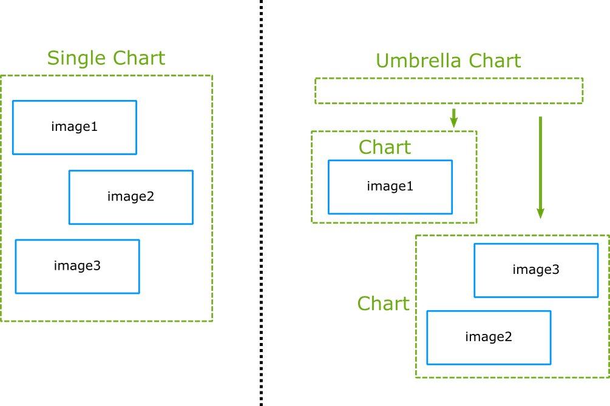
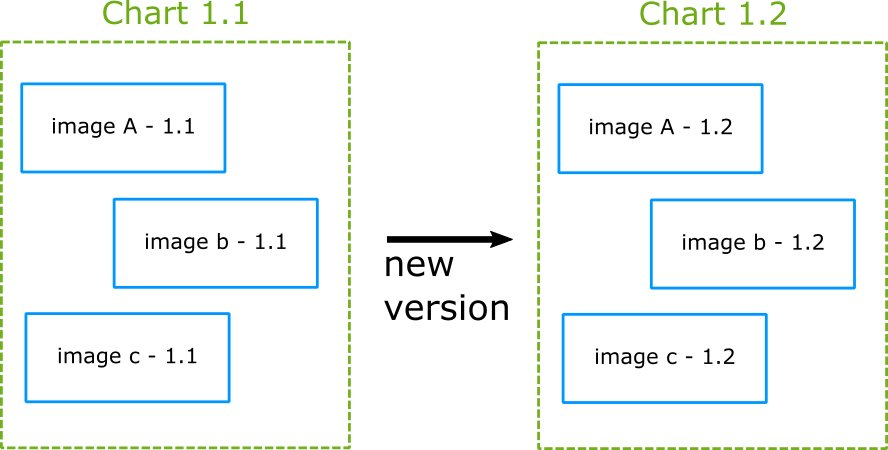
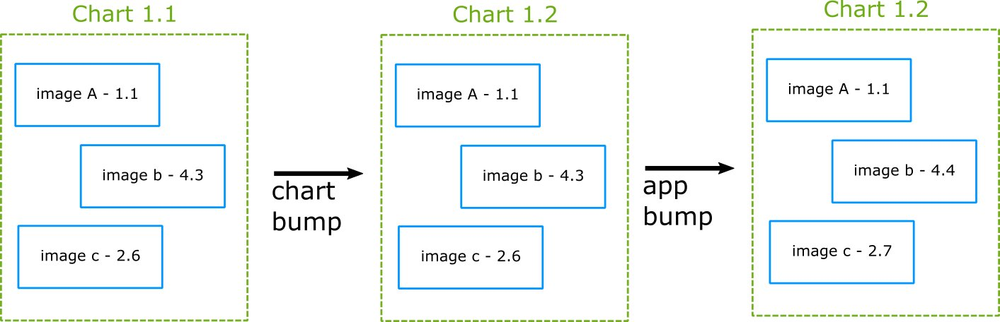

# Helm

Interacting directly with Kubernetes involves either manual configuration using the kubectl command line utility, or passing various flavors of YAML data to the API. This can be complex and is open to human error creeping in. In keeping with the DevOps principle of ‘configuration as code’, we leverage Helm to create atomic blocks of configuration for your applications.

Helm simplifies Kubernetes configuration through the concept of a Chart, which is a set of files that together specify the meta-data necessary to deploy a given application or service into Kubernetes. Rather than maintain a series of boilerplate YAML files based upon the Kubernetes API, Helm uses a templating language to create the required YAML specifications from a single shared set of values. This makes it possible to specify re-usable Kubernetes applications where configuration can be selectively over-ridden at deployment time.

Helm is a package manager for Kubernetes (think apt or yum). It works by combining several manifests into a single package that is called a chart. Helm also supports chart storage in remote or local Helm repositories that function like package registries such as Maven Central, Ruby Gems, npm registry, etc.

Helm is currently the only solution that supports

- The grouping of related Kubernetes manifests in a single entity (the chart)
- Basic templating and value support for Kubernetes manifests
- Dependency declaration between applications (chart of charts)
- A registry of available applications to be deployed (Helm repository)
- A view of a Kubernetes cluster in the application/chart level
- Management of installation/upgrades of charts as a whole
- Built-in rollback of a chart to a previous version without running a CI/CD pipeline again

You can find a list of public curated charts in the [default](https://github.com/helm/charts/tree/master/stable) Helm repository.

## Common Helm misconceptions

Any new technology requires training on how to use it effectively. If you have already worked with any type of package manager, you should be familiar with how Helm works.

Here is a list of important Helm points that are often controversial between teams.

### 1. Helm repositories are optional

Using Helm repositories is a recommended practice, but completely optional. You can deploy a Helm chart to a Kubernetes cluster directly from the filesystem.

Helm can install a chart either in the package (.tgz) or unpackaged form (tree of files) to a Kubernetes cluster right away. Thus, the most minimal Helm pipeline has only two steps:

- Checkout from git a Helm chart described in uncompressed files.
- Install this chart to a Kubernetes cluster.

### 2. Chart versions and appVersions

Each Helm chart has the ability to define two separate versions:

- The version of the chart itself (version field in Chart.yaml).
- The version of the application contained in the chart (appVersion field in Chart.yaml).

These are unrelated and can be bumped up in any manner that you see fit. You can sync them together or have them increase independently. There is no right or wrong practice here as long as you stick into one.

### 3. Charts and sub-charts

The most basic way to use Helm is by having a single chart that holds a single application. The single chart will contain all the resources needed by your application such as deployments, services, config-maps etc.

However, you can also create a chart with dependencies to other charts (a.k.a. umbrella chart) which are completely external using the requirements.yaml file. Using this strategy is optional and can work well in several organizations. Again, there is no definitive answer on right and wrong here, it depends on your team process.

### 4. Helm vs K8s templates

Helm is a package manager that also happens to include templating capabilities. Unfortunately, a lot of people focus only on the usage of Helm as a template manager and nothing else.

Technically Helm can be used as only a templating engine by stopping the deployment process in the manifest level. It is perfectly possible to use Helm only to create plain Kubernetes manifests and then install them on the cluster using the standard methods (such as kubectl). But then you miss all the advantages of Helm (especially the application registry aspect).

At the time of writing Helm is the only package manager for Kubernetes, so if you want a way to group your manifests and a registry of your running applications, there are no off-the-shelf alternative apart from Helm.

Here is a table that highlights the comparison:

Helm Feature |	Alternative
--- | --- 
Templating |	Kustomize, k8comp, kdeploy, ktmpl, kuku, jinja, sed, awk, etc.
Manifest grouping (entity/package) |	None
Application/package dependencies |	None
Runtime view of cluster packages |	None
Registry of applications |	None
Direct rollbacks and upgrades |	None

## Helm packaging strategies

As mentioned before a Helm chart version is completely different than the application version it contains. This means that you can track versions on the Helm chart itself separately from the applications it defines.

### 1. Simple 1-1 versioning

This is the most basic versioning approach and it is the suggested one if you are starting out with Helm. Don’t use the `appVersion` field at all (it is optional anyway) and just keep the chart version in sync with your actual application.

This approach makes version bumping very easy (you bump everything up) and also allows you to quickly track what application version is deployed on your cluster (same as chart version).

The downside of this approach is that you can’t track chart changes separately.

### 2. Chart versus application versioning

This is an advanced approach which you should adopt if changes are happening in the charts themselves all the time (i.e. in the templates) and you want to track them separately from the application.

An important point here is that you need to adopt a policy in your team on what a “chart change” means. Helm does not enforce chart version changes. You can deploy a different chart with the same version as the previous one. So, if this is something that you want to do, you need to make sure that all teams are on the same page for versioning practices.

On the plus side, this workflow allows you to individually version charts and applications and is very flexible for companies with teams that manage separately the charts from the application source code.

### 3. Umbrella charts

Umbrella charts are charts of charts. They add an extra layer of complexity on both previous approaches. You can follow the same paradigms in umbrella charts. Either the parent chart has the same version as everything else (first approach) or it has a version on its own.

In the second case, you need to agree with your team on when exactly the parent chart version should be bumped. Is it only when a child chart changes? Only when an application changes? or both?

The answer does not really matter as long as your team follows the same rules.

## Helm promotion strategies

A Helm chart (like a Docker image) should be promoted between environments. It should start with testing and staging environments and gradually move to production ones.

### 1. Single repository with multiple environments

This is the most basic deployment workflow. You have a single Helm chart (which is exactly the same across all environments). It is deployed to multiple targets using a different set of values.

### 2. Chart promotion between repositories and environments

A more advanced workflow (useful in organizations with multi-location deployments) is the promotion of Helm releases between both repositories and environments.

There are different pipelines for:

1. Creating the Helm chart and storing it to a staging Helm repository
2. Deployment of the Helm chart to a staging environment. After it is tested the chart is promoted to one or more “production” Helm repositories
3. Deployment of the promoted Helm chart happens to one of the production environments

While this workflow is very flexible, it adds complexity on the number of Helm charts available (since they exist in multiple Helm repositories). You also need to set up the parameters between the different pipelines so that Helm charts to be deployed can be indeed found in the expected Helm repository.
