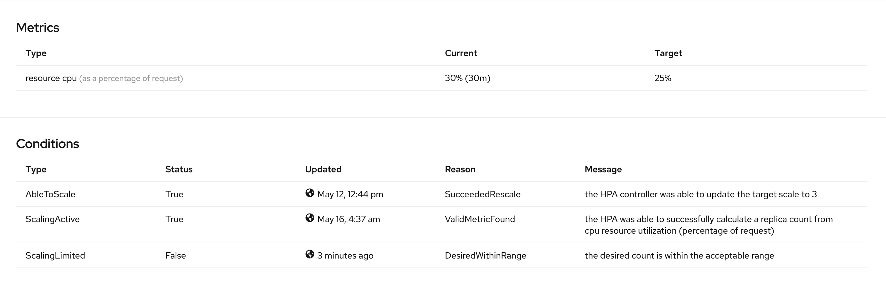
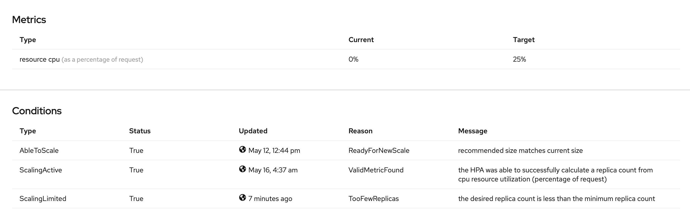

# Autoscaling

Autoscaling is a process of scaling up/down where pods are increased/decreased in order to distribute load between them if the load on the pods gets greater/less then the defined threshold. Application Autoscaling can be done using `HorizontalPodAutoscaler` which is defined by Kubernetes API `autoscaling/v1` or `autoscaling/v2beta2`

## Prerequisites

In order to use Horizontal Pod Autoscalers, your cluster administrator must have properly configured cluster metrics.
You can use the `oc describe PodMetrics <any-pod-name>` command to determine if metrics are configured. If metrics are configured, the output appears similar to the following, with `Cpu` and `Memory` displayed under Usage.

```yaml
...
Containers:
  Name:  pod-name-xyz
  Usage:
    Cpu:     17877836n
    Memory:  503572Ki
...
```
## HorizontalPodAutoscaler

Stakater [Application Chart](https://github.com/stakater-charts/application) uses `autoscaling/v2beta2` API which provides additional metrics other then CPU only to be used as a metrics for autoscaling. These metrics can be CPU, Memory or custom metrics exposed by the application [See here](https://kubernetes.io/docs/tasks/run-application/horizontal-pod-autoscale-walkthrough/#autoscaling-on-multiple-metrics-and-custom-metrics)

| Metrics | Description |
|--- |--- |
| CPU Utilization | Number of CPU cores used. Can be used to calculate a percentage/Integer Value of the pod's requested CPU. |
| Memory Utilization | Amount of memory used. Can be used to calculate a percentage/Integer Value of the pod's requested memory. |

## Defining Autoscaling on CPU

To define Autoscaling on the basis of CPU define the autoscaling section in your HelmRelease object.

In the following example we will use `averageUtilization` ( in Percentage) calculated on all the pods.

```yaml
autoscaling:
  enabled: true
  minReplicas: 3                    # Minimum running pods 
  maxReplicas: 10                   # Maximum running pods
  additionalLabels: {}
  annotations: {}
  metrics:
  - type: Resource
    resource:
      name: cpu                     # Define autoscaling on the basis of CPU
      target:
        type: Utilization           # Calculate on the basis of Utilization Percentage (in percentage of the requested CPU)
        averageUtilization: 80      # Scale when the average utilization of all pods go above 80%
```


## Defining Autoscaling on Memory

To define Autoscaling on the basis of CPU define the autoscaling section in your HelmRelease object.

In the following example we will use `averageValue` (in integer value) calculated on all the pods.

```yaml
autoscaling:
  enabled: true
  minReplicas: 3                    # Minimum running pods 
  maxReplicas: 10                   # Maximum running pods
  additionalLabels: {}
  annotations: {}
  metrics:
  - type: Resource
    resource:
      name: memory                  # Define autoscaling on the basis of memory
      target:
        type: AverageValue          # Calculate on the basis of Utilization Value ( in integer value )
        averageValue: 500Mi         # Scale when the average utilization of all pods go above 500Mi
```

## Autoscaling with GitOps

If you are using gitOps to manage your applications across clusters, you need to ignore the difference for replica count to make autoscaling work.

**Problem:**
When your hpa will try to increase the number of pods, at the same time your gitOps tool will also try to maintain the original state of your application and it will terminate the newly created pods after autoscaling.

**Solution:**
Update your gitOps tool to ignore the difference for replica count, so that whenever hpa scales up the number of pods and increases the replica count, the gitOps tool doesn't try to sync the replica count and doesn't terminate the new pods.

**Example (argoCD):**
Argo CD allows [ignoring differences](https://argoproj.github.io/argo-cd/user-guide/diffing/#application-level-configuration) at a specific JSON path, using JSON patches. The following sample application is configured to ignore differences in spec.replicas for all deployments

```yaml
spec:
  ignoreDifferences:
  - group: apps
    kind: Deployment
    jsonPointers:
    - /spec/replicas
```

## How to test HPA

To test the HorizontalPodAutoscaler with your application, you need to install the HPA for your application and then gradually increase the load (memory or cpu depending on hpa configuration). You can use tools like postman, jmeter, readyAPI or a manual [script](https://kubernetes.io/docs/tasks/run-application/horizontal-pod-autoscale-walkthrough/#increase-load) to increase the load on your application.

You can monitor the Horizontal Pod Auto Scaler from your openshift/kubernetes dashboard or with command

```bash
kubectl describe hpa <hpa-name>
```
The cpu/memory usage and the events should show the application pods getting scaled up and down when the load increases or decreases.

**HPA Metrics:**



**HPA Events:**


# Useful Links

- [Autoscaling in OpenShift](https://docs.openshift.com/container-platform/4.4/nodes/pods/nodes-pods-autoscaling.html)

- [Kubernetes Example](https://kubernetes.io/docs/tasks/run-application/horizontal-pod-autoscale-walkthrough/)

- [How it works](https://kubernetes.io/docs/tasks/run-application/horizontal-pod-autoscale/)

