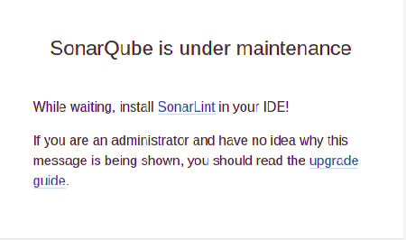
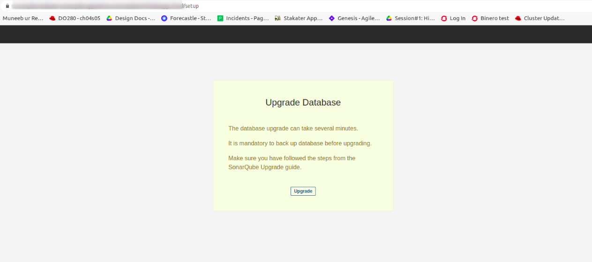

# SonarQube Upgrade

Before upgrading, it helps to understand how SonarQube version numbers work. Version numbers have up to three digits with each digit representing part of the release cycle:

## Major version number

The major version number represents a series of releases with high-level objectives for the release cycle. 

## Minor version number

The minor version number corresponds to incremental functional changes within a major release cycle. At the time of an LTS release, the release cycle is closed and the minor version number is frozen.

## Patch release number

Only on LTS versions, the patch release number represents patches to an LTS that fixed blocker or critical problems. The patch release number isn't considered in your upgrade migration path, and your migration path is the same no matter which patch number you are on.

## Migration Path

Upgrading across multiple non-LTS versions is handled automatically. However, if there's one or multiple LTS versions in your migration path, you must first migrate to each intermediate LTS and then to your target version. Forexample
`From 6.7.7 LTS to 8.9 LTS, the migration path is 6.7.7 LTS to 7.9.6 LTS and then to the latest 8.9.7 LTS patch`

## SonarQube Upgrade to 8.9 LTS

Before starting the upgrade , back up your SonarQube Database. During upgrade, tables may be duplicated to speed up the migration process, and this could cause database disk usage to double. Because of this, it is recommended that database disk usage is below 50% before starting a migration. 
Please refer to the [Link](https://docs.sonarqube.org/8.9/setup/upgrade-notes/) for SonarQube Release 8.9 LTS Upgrade Notes.

## SonarQube Upgrade from 7.9.1 to 8.9.7 LTS

In order to upgrade sonarqube from 7.9.1 to 8.9.7 LTS below steps need to be followed.
- Sonarqube stateful set image needs to be updated to `image: docker.io/stakater/sonarqube:v1.0.11` .
- Below environment variables are depreciated and need to be updated.
  `JDBC_URL` is depreciated and needs to be updated to `SONAR_JDBC_URL`.
  `FORCE_AUTHENTICATION` is depreciated and needs to be updated to `SONAR_FORCEAUTHENTICATION`.
  `SONAR_AUTOCREATE_USERS` is depreciated and needs to be updated to `SONAR_AUTHENTICATOR_CREATEUSERS`.
  `SONAR_SEARCH_JAVA_ADDITIONAL_OPTS` is depreciated and needs to be updated to `SONAR_SEARCH_JAVAADDITIONALOPTS`.

- Once the above changes applied on openshift-cluster, pod will restart and after the pod status came back to running, access the sonarqube route which will direct us to installation of plugins page.

- After selecting `I understand the risk` option, it will direct us to the page `SonarQube is under maintenance`.

- Once `SonarQube is under maintenance` option is selected , it will direct us to `Upgrade Database` page.

.

- After selecting the Upgrade option, it takes some time and after that sonarqube will be updated and sonarqube window appears.

