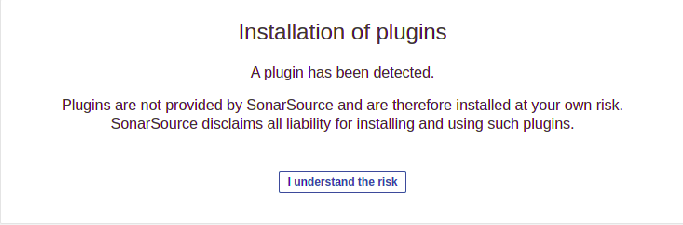

# SonarQube Upgrade

Before upgrading, it helps to understand how SonarQube version numbers work. Version numbers have up to three digits with each digit representing part of the release cycle:

## Migration Path

We upgrade sonarqube from LTS to LTS. However, if there's one or multiple LTS versions in migration path, we first migrate to intermediate LTS and then to target LTS version. Forexample
`From 6.7.7 LTS to 8.9 LTS, the migration path is 6.7.7 LTS to 7.9.6 LTS and then to the latest 8.9.7 LTS patch`

## SonarQube Upgrade to 8.9 LTS

Before starting the upgrade , back up your SonarQube Database. During upgrade, tables may be duplicated to speed up the migration process, and this could cause database disk usage to double. Because of this, it is recommended that database disk usage is below 50% before starting a migration. 
Please refer to the [Link](https://docs.sonarqube.org/8.9/setup/upgrade-notes/) for SonarQube Release 8.9 LTS Upgrade Notes.

## SonarQube Upgrade from 7.9.1 to 8.9.7 LTS

- After upgrade configurations applied on openshift-cluster, pod will restart and once the pod status came back to running, sonarqube route will direct us to installation of plugins page.

- After selecting `I understand the risk` option, it will direct us to the page `SonarQube is under maintenance`.

- On `SonarQube is under maintenance` page add `/setup` on address bar which will direct us to `Upgrade Database` page.

.

- After selecting the Upgrade option, SonarQube will take some time to update and after that sonarqube window appears.

