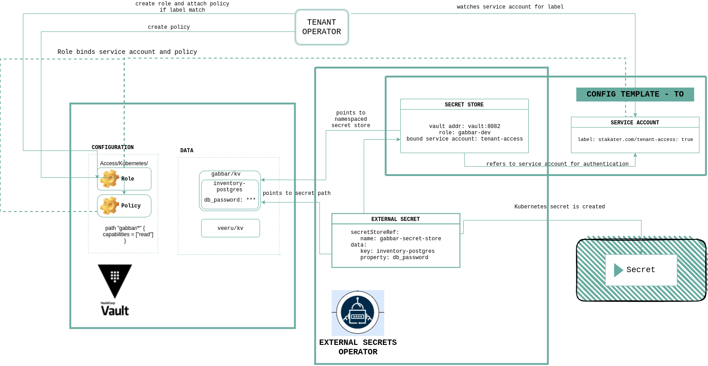

# External Secret Operator Workflow

## Workflow

### Step 1

In `externalSecret` we define details of secrets available in vault and secret store that reference vault connection and authentication details.

### Step 2

Secret Store `tenant-vault-secret-store` is already created in each namespace by Tenant Operator templates. It refers to service account `tenant-vault-access` for authentication. Secret Store also refers to vault `role` created with the same name as namespace name by Tenant Operator.

### Step 3

Service account `tenant-vault-access` being referred by `SecretStore` is already created by Tenant Operator templates. This service account has label `stakater.com/vault-access: 'true'` that is used to bound it with vault `role` by Tenant Operator. To know more how Tenant Operator authenticates with Vault, see [this].(https://docs.cloud.stakater.com/content/sre/tenant-operator/vault-authentication.html)

### Step 4

Vault verifies if the defined service account has access to `role` and `role` has an attached `policy` that grants access to requested path.

### Step 5

After authentication is successful, external secrets get data from the path requested from the vault.

### Step 6

Kubernetes secret is created from the values stored in vault.