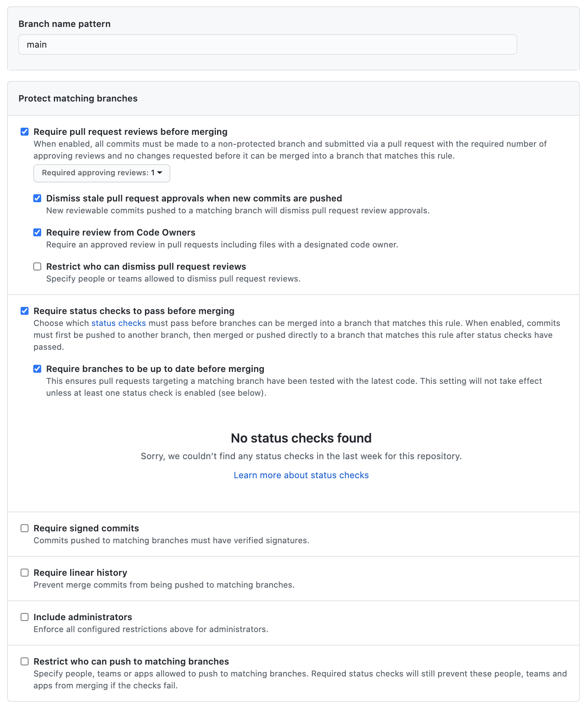

# Configuring gitops-config repo on GitHub

- Create a git repo and name it `gitops-config` and put in the description `Single source of truth for declarative workloads to be deployed on Stakater App Agility Platform`
- Enable branch protection; `Settings > Branches > Branch protection rules` and then click `Add rule` and select following only

- Add the Stakater bot user as collaborator with `Admin` permissions (ask Stakater team about the bot user id); `Settings > Manage access > Invite people or team`

For more about bot account permissions. [Read here](https://docs.cloud.stakater.com/content/sre/gitops/bot-account.html)
