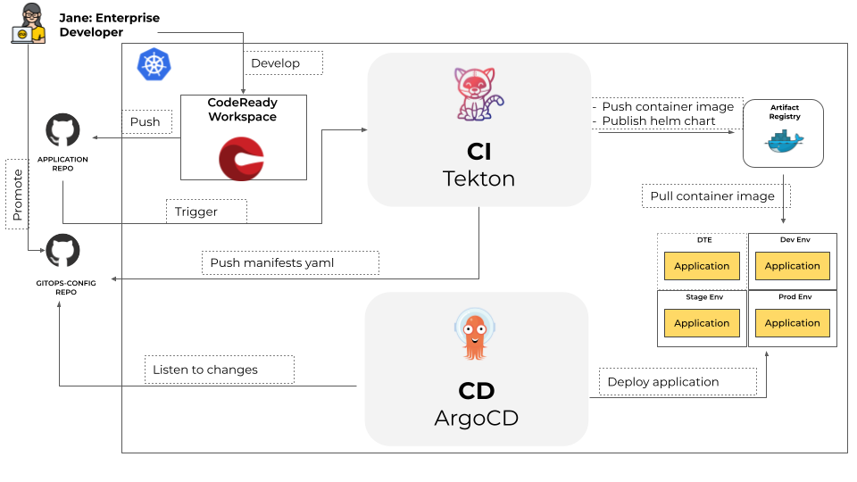

# GitOps for Application Delivery

## Why

As a software organization, I would like to:

* Audit all changes made to pipelines, infrastructure, and application configuration.
* Roll forward/back to desired state in case of issues.
* Consistently configure all environments.
* Reduce manual effort by automating application and environment setup and remediation.
* Have an easy way to manage application and infrastructure state across clusters/environments.

## What

* GitOps is a natural evolution of DevOps and Infrastructure-as-Code.
* GitOps is when the infrastructure and/or application state is fully represented by the contents of a git repository. Any changes to the git repository are reflected in the corresponding state of the associated infrastructure and applications through automation.

## Principles

* Git is the source of truth.
* Separate application source code (Java/Go) from deployment manifests i.e the application source code and the GitOps configuration reside in separate git repositories.
* Deployment manifests are standard Kubernetes (k8s) manifests i.e Kubernetes manifests in the GitOps repository can be simply applied with nothing more than a `oc apply`.
* Helm for defining the differences between environments.

## How is GitOps different from DevOps?

GitOps and DevOps do share some of the same principles and goals. DevOps is about cultural change and providing a way for development teams and operations teams to work together collaboratively.

GitOps gives you tools and a framework to take DevOps practices, like collaboration, CI/CD, and version control, and apply them to infrastructure automation and application deployment. 

Developers can work in the code repositories they already know, while operations can put the other necessary pieces into place.

## How?

