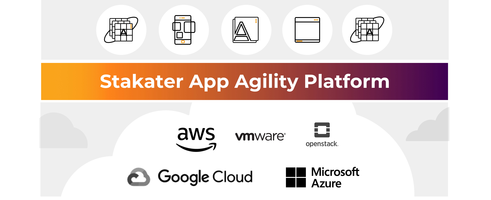

# Stakater App Agility Platform (AAP) Introduction

At Stakater, we believe that Kubernetes is becoming the new foundation for compute and that over time, most applications will run on it in some form.

Organizations have adopted containers and Kubernetes to automate their applications operations and make their business applications portable, secure, easy to manage and scalable. While booting a Kubernetes cluster is fairly painless, a production grade Kubernetes environment can be complex, and require significant expertise to operate. Additionally managing an application platform on top of that is considerably challenging. Companies not only require an application stack for running their business processes, they need such an application stack to be configurable yet consistent and auditable, upgradable and devops enabled yet upgradable and cost-effective.

Companies require a solution with a justifiable return on their investment.

Built by open source leaders, Red Hat® OpenShift® is the leading enterprise Kubernetes platform. Stakater App Agility Platform is a fully managed enterprise Kubernetes platform hosted on AWS, Google, Azure, VMWare & OpenStack. With Stakater App Agility Platform, innovators can focus on what matters, stay competitive, and outpace rising customer expectations without worrying about managing the underlying infrastructure.

With Stakater App Agility Platform, Stakater builds and manages your OpenShift clusters, allowing you to focus on your business. We offer Stakater App Agility Platform for on-premises or your choice of public cloud allowing you to optimize your multi-cloud strategy that best suits your needs. Stakater App Agility Platform enables your teams across your organizations to consume OpenShift as a Service.
