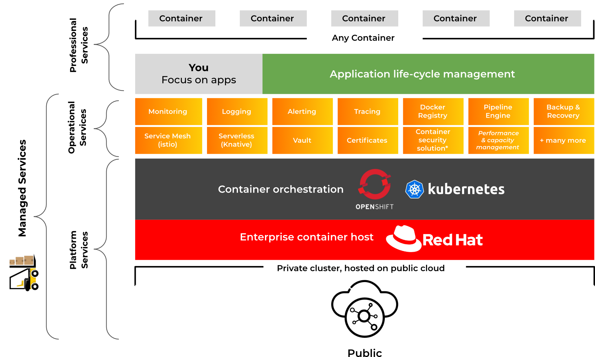

# Stakater App Agility Platform Features

### Fully managed enterprise Kubernetes
- Professionally managed infrastructure
- Automated deployment of OpenShift clusters
- Automated scaling configuration
- High availability and disaster recovery management
- Storage configuration and backup management
- Network and firewall management
- Patch and upgrade management
- Provision management, security, backup, network components
- Security processes and controls aligned with industry standards.
- Virtual network integration
- Persistent storage volumes
- Flexible pricing and consumption. Use existing clouds or purchase a standard cluster through Stakater.

### Full-service clusters
- World class support
- Global regional availability
- End-to-end service including building, installing, upgrading, managing, and maintaining every cluster.
- High uptime (99.5% uptime SLA and support)

### Supporting services
- Automated development workflows
- System service monitoring and log management
- Identity and access management
- Compliance and security policy enforcement
- Performance and capacity management
- Image and registry management

