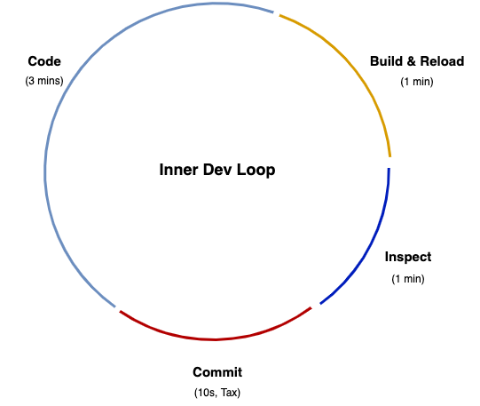
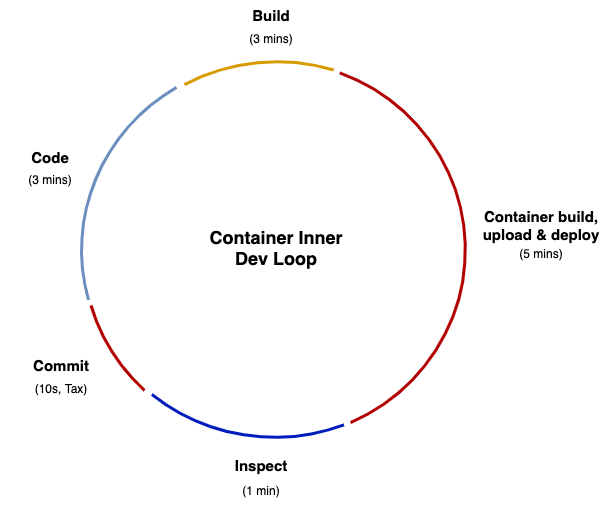

# What is Inner Loop?

The inner dev loop is the single developer workflow. A single developer should be able to set up and use an inner dev loop to code and test changes quickly.

Even within the Kubernetes space, developers will find much of the inner dev loop familiar. That is, code can still be written locally at a level that a developer controls and committed to version control.

In a traditional inner dev loop, if a typical developer codes for 360 minutes (6 hours) a day, with a traditional local iterative development loop of 5 minutes — 3 coding, 1 building, i.e. compiling/deploying/reloading, 1 testing inspecting, and 10-20 seconds for committing code — they can expect to make ~70 iterations of their code per day. Any one of these iterations could be a release candidate. The only “developer tax” being paid here is for the commit process, which is negligible.

*In search of lost time: How does containerization change the inner dev loop?*

The inner dev loop is where writing and testing code happens, and time is critical for maximum developer productivity and getting features in front of end users. The faster the feedback loop, the faster developers can refactor and test again.

Changes to the inner dev loop process, i.e., containerization, threaten to slow this development workflow down. Coding stays the same in the new inner dev loop, but code has to be containerized. The containerized inner dev loop requires a number of new steps:

- packaging code in containers
- writing a manifest to specify how Kubernetes should run the application (e.g., YAML-based configuration information, such as how much memory should be given to a container)
- pushing the container to the registry
- deploying containers in Kubernetes

Each new step within the container inner dev loop adds to overall development time, and developers are repeating this process frequently. If the build time is incremented to 5 minutes — not atypical with a standard container build, registry upload, and deploy — then the number of possible development iterations per day drops to ~40. At the extreme that’s a 40% decrease in potential new features being released. This new container build step is a hidden tax, which is quite expensive.

