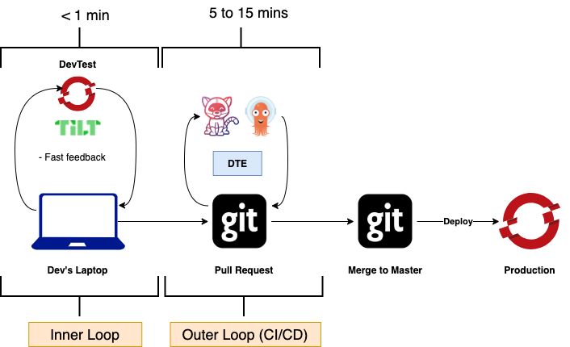

# Inner vs Outer Loop

The inner loop consists of local coding, building, running, and testing the application—all activities that you, as a developer, can control. The outer loop consists of the larger team processes that your code flows through on its way to the cluster: code reviews, integration tests, security and compliance, and so on. The inner loop could happen mostly on your laptop. The outer loop happens on shared servers and runs in containers, and is often automated with continuous integration/continuous delivery (CI/CD) pipelines. Usually, a code commit to source control is the transition point between the inner and outer loops.

First, let's consider a typical workflow for a developer whose team has adopted Kubernetes. The workflow starts with local development activities and finishes with containers deployed and code running in one or more Kubernetes clusters. To help visualize this flow, you can think of it in terms of an inner loop and an outer loop. The inner loop consists of local coding, building, running, and testing the application—all activities that you, as a developer, can control. The outer loop consists of the larger team processes that your code flows through on its way to the cluster: code reviews, integration tests, security and compliance, and so on. The inner loop could happen mostly on your laptop. The outer loop happens on shared servers and runs in containers, and is often automated with continuous integration/continuous delivery (CI/CD) pipelines. Usually, a code commit to source control is the transition point between the inner and outer loops. Figure 1 illustrates the interplay of these loops in a Kubernetes development process.

Notice that, while you code, you are constantly iterating through various development activities: You code, build, deploy locally, and debug—and you keep going until you achieve a degree of feature completeness. At some point, you will be ready to transition from inner to outer, right? Not so quick.

## Deploying from the inner loop

You might think that your job stops at local testing and a Git pull request (or a `git push`)—but that's not usually the case. You will still need to ensure that your code functions correctly in containers, runs in the cluster, and plays nicely with other containerized components. Therefore, you will want some iterations of your inner loop to deploy and debug directly into the Kubernetes cluster.

Here's a list of steps you might typically follow to deploy from the inner loop:

1. Describe how to configure the OS for your container:
  - Write a Dockerfile to set up Linux.
2. Describe how to package your app into a container image:
  - Update the Dockerfile.
3. Create a container image:
  - Issue the commands `docker build` and `docker tag`.
4. Upload the container image to a registry:
  - Issue a `docker push`.
5. Write one or more Kubernetes or OpenShift resource files:
  - Write lots of YAML.
6. Deploy your app to the cluster:
  - Issue the command: `kubectl apply -f my_app.yaml`.
7. Deploy other services to the cluster:
  - Issue the command: `kubectl apply -f svc*.yaml`.
8. Write the config (or set `ENV`) to allow apps to work together:
  - Issue a `kubectl create configmap`.
9. Configure apps to work together correctly:
  - Issue a `kubectl apply -f my_configmap.yaml`.

That's a lot of steps!

Enter Tilt! which can help make many of those steps easier.
