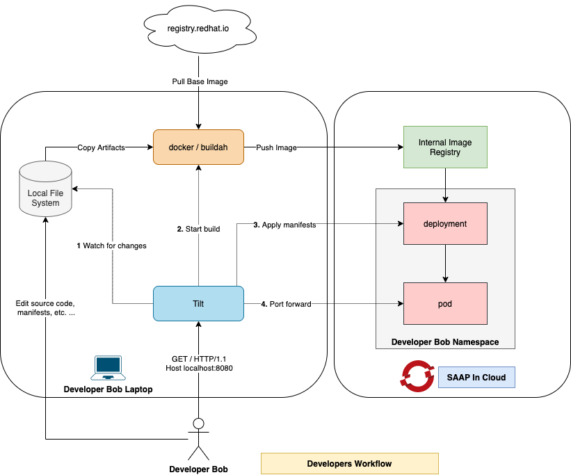

# Local Development Workflow

The diagram below depicts a development workflow orchestrated by Tilt. After you execute the tilt up command on your development machine, Tilt will keep running while performing the following actions:

1. Tilt watches for changes in the source code made by the developer on the local machine.
2. After a change has been detected, Tilt executes docker/buildah to update the container image. After the build completes, the updated container image is pushed to the internal docker registry.
3. Tilt watches Kubernetes manifests on the local machine and keeps them in sync with cluster. Any changes made to the manifests are instantly applied to cluster.
4. Tilt forwards local ports to the application pod running in cluster. This allows the developer to conveniently access the application on localhost.

Tilt helps the developer automate many of the manual steps made during the development of containerized applications. It speeds up the edit-compile-run loop considerably.
