# Step by Step Guide

In this guide we will deploy an application with tilt and namespace in remote OpenShift cluster

1) Clone this sample repo [nordmart-review](https://github.com/stakater-lab/stakater-nordmart-review)

2) Install following tools:

Required for local development:

- `Tilt` v0.22.11 or above
- `Docker` 20.10.8 or above
- `Helm` 3 or above
- `oc` binaries

Required by this application:

- `Java` 11
- `Maven` 3

3) You should have a namespace in remote/local cluster; If you are in SAAP then enable sandbox namespace/project/environment for your tenant; you can read more [here](https://docs.cloud.stakater.com/content/sre/tenant-operator/customresources.html#_1-tenant)

4) Login to cluster

Login into OpenShift and then copy login command

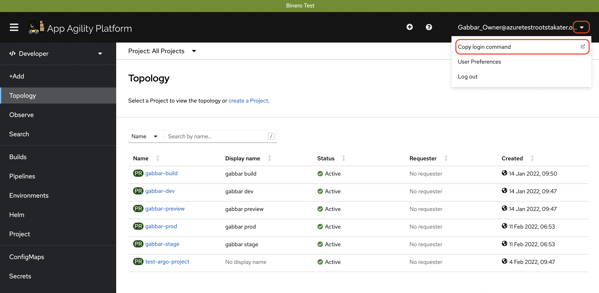

Then click `Display Token`

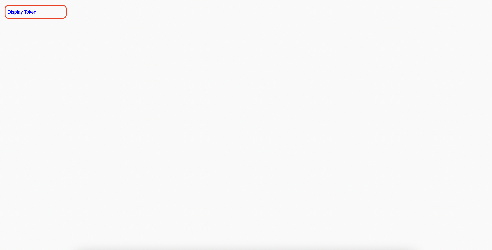

Then copy the login token


And then run this command in the terminal

```bash
oc login --token=<TOKEN> --server=<SERVER>
```

5) Switch project to sandbox namespace/project/environment

```bash
oc project <MY-SANDBOX>
```

6) Login to OpenShift internal docker registry

First get the OpenShift internal docker registry URL and set in HOST variable name

```bash
HOST=image-registry-openshift-image-registry.apps.[CLUSTER-NAME].[CLUSTER-ID].kubeapp.cloud
```
NOTE: Ask SCA (SAAP Cluster Admin) or cluster-admin to provide you the OpenShift internal registry route

Then login into docker registry with following command

```bash
docker login -u $(oc whoami) -p $(oc whoami -t) $HOST
```

If you get this error `x509: certificate signed by unknown authority` then you need to update your `/etc/docker/daemon.json` file and add the insecure registry

```bash
{
    "insecure-registries" : [ "HOST" ]
}
```

7) (Optional) Add helm chart repos

If you reference helm charts from private registry then you first need to add it

```bash
cd deploy

# helm credentials can be found in vault or in a secret in build namespace
helm repo add stakater-nexus <private repo url> --username helm-user-name --password ********; 

cd ..
```

8) Update helm dependencies

```bash
cd deploy

helm dependency update

cd ..
```

9) Go through the [Tiltfile](https://github.com/stakater-lab/stakater-nordmart-review/blob/main/Tiltfile) of the application 

10) Check the `local_resource` section in the Tiltfile
 
11) Create `tilt_options.json` file

Remove `.template` from the file named `tilt_options.json.template`

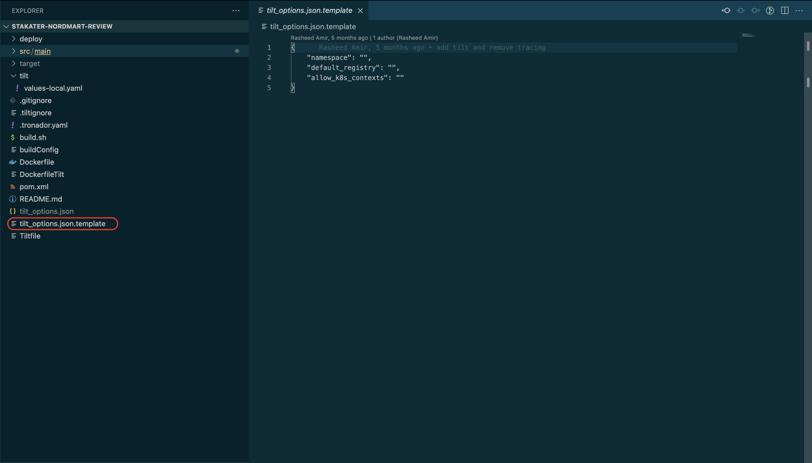

And then fill up all three things

1. `namespace`: your sandbox environment name
2. `default_registry`: the openshift internal registry route (you have set in step # 6 in HOST above) and then add your namespace name after `/`
3. `allow_k8s_contexts`: given you are logged in the cluster; then run `oc config current-context` to get the value for `allow_k8s_contexts`

e.g.

```json
{
    "namespace": "tilt-username-sandbox",
    "default_registry": "image-registry-openshift-image-registry.apps.[CLUSTER-NAME].[CLUSTER-ID].kubeapp.cloud/tilt-username-sandbox",
    "allow_k8s_contexts": "tilt-username-sandbox/api-[CLUSTER-NAME]-[CLUSTER-ID]-kubeapp-cloud:6443/user@email.com"
}
```

12) Go through the `.gitigore` and check tilt and helm specific ignores

```
# Tilt
tilt_options.json
tilt_modules/

# Helm
/deploy/charts
```

13) Go through `.tiltignore`

```
**/charts
**/tmpcharts
```

14) Go through `values-local.yaml` in a `tilt` folder in base application directory. 

`values-local.yaml` should contain the following content. Make sure that replica count should always be 1.

```yaml
application:
    
  deployment:
    imagePullSecrets: null

    # Tilt live update only supports one replica
    replicas: 1

    image:
      tag: null
```

15) Validate this application is not running already


16) Run `tilt up` at base directory 

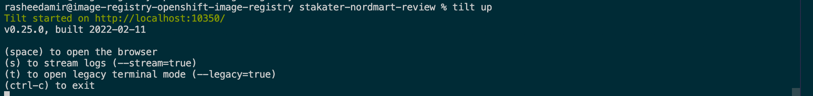

Open the tilt browswer; just hit the space

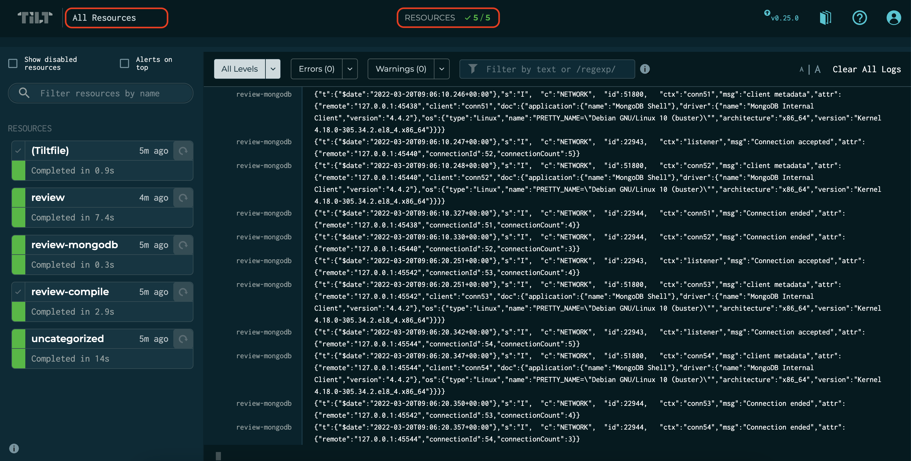

If everything is green then the application will be deployed in the cluster

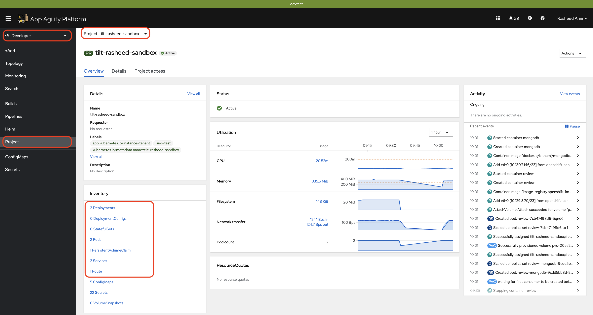

Press space key to view the progress in Tilt web UI. The application should be running in the namespace used in `tilt_options.json` file.

17) Lets browse through some reviews; go to routes

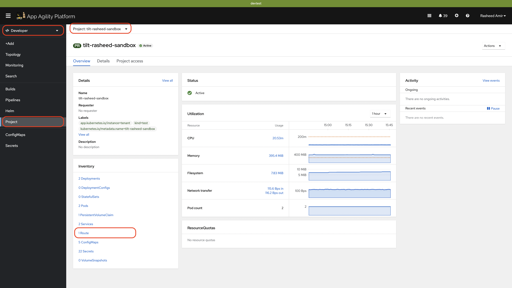

Click on the review route

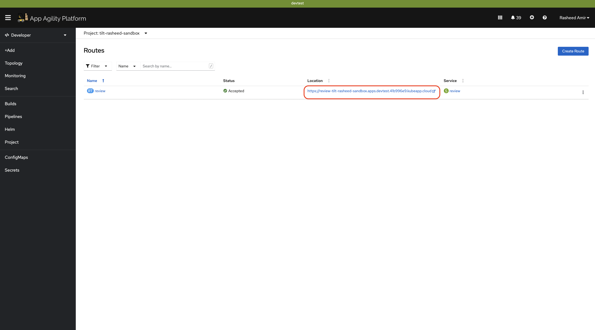

In the end of the route add `/api/review/329199`

Review the json output

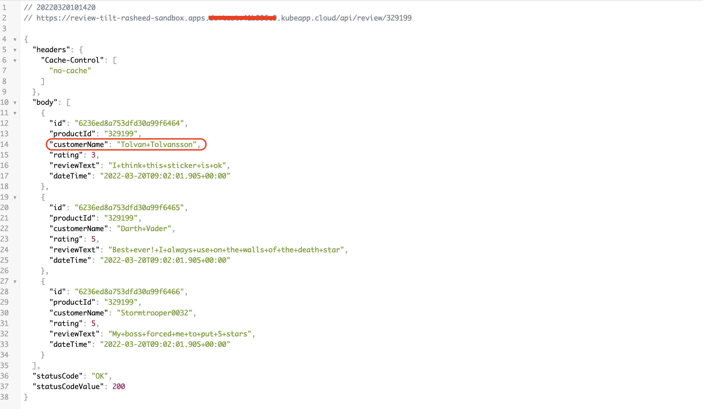

18) Lets make one change; we will update the first review text to "Tilt Demo"

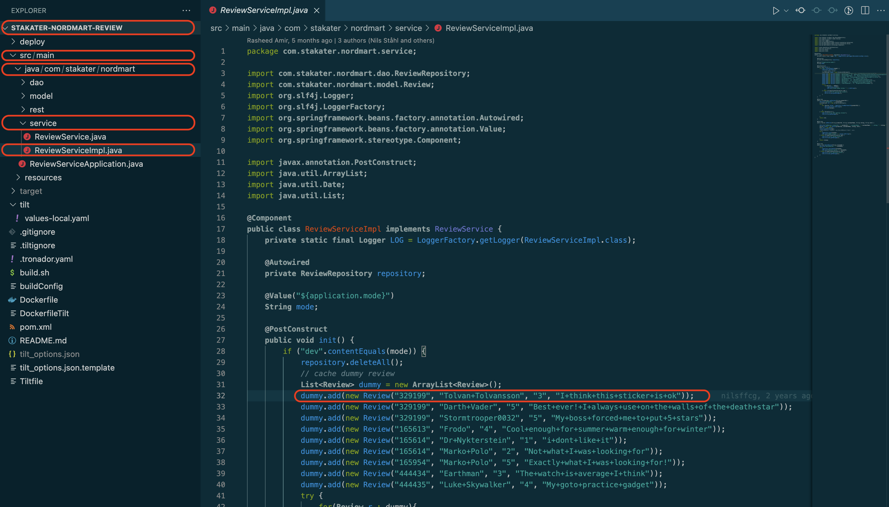

Switch back to tilt browser and you will see it has started picking up changes

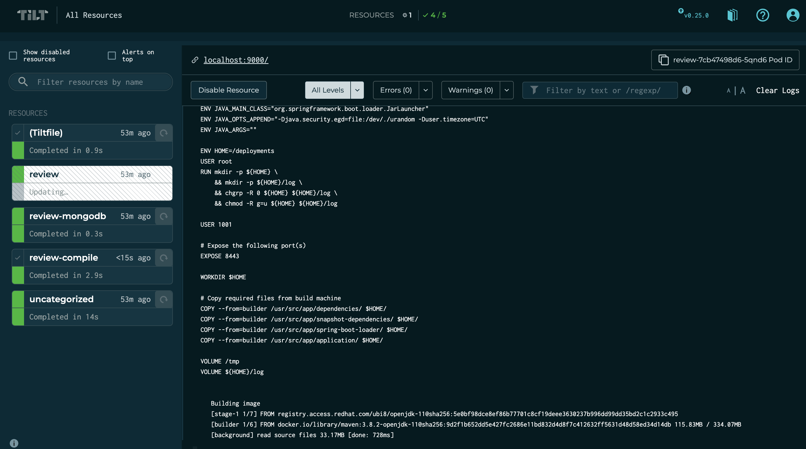

Within few seconds the change will be deployed; and you can refresh the route to see the change

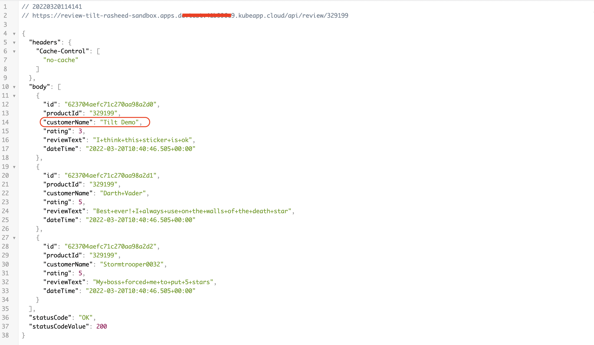

Awesome! you made it

19) Run `tilt down` to delete the application and related configuration from the namespace
