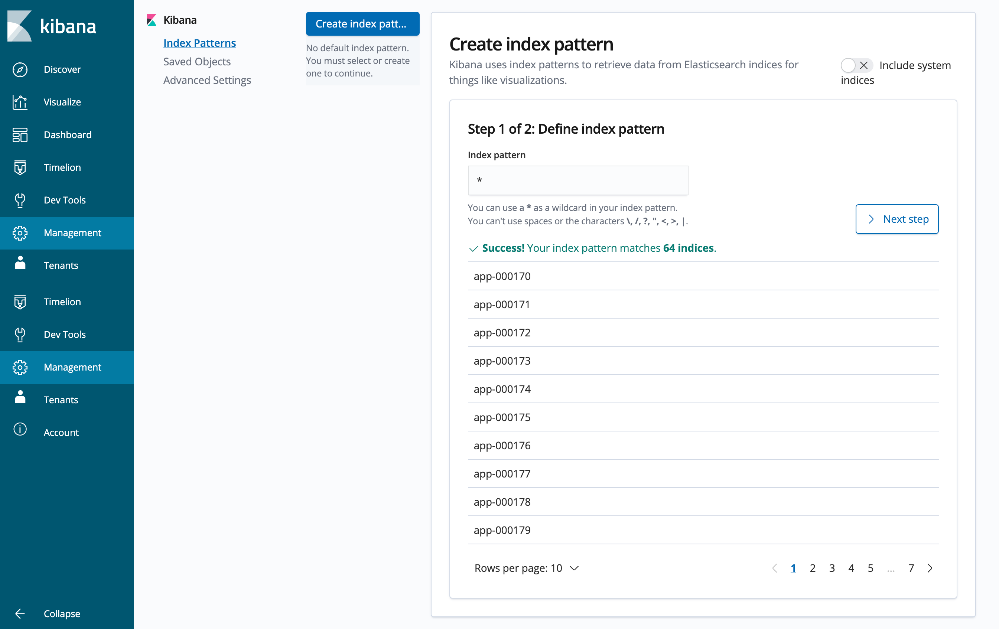
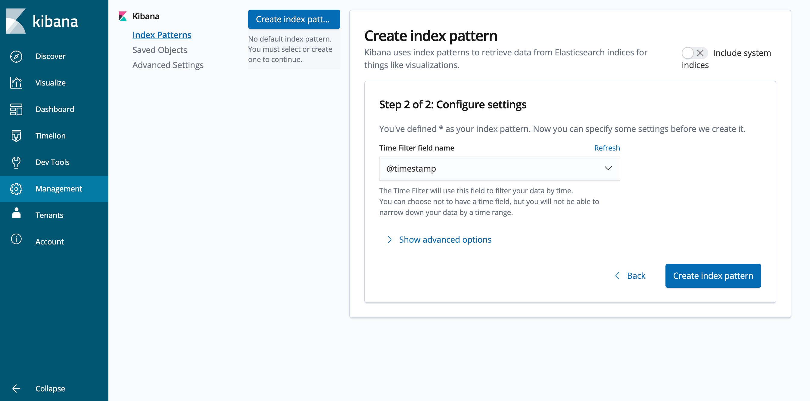

# How to access logs on Kibana?

Below are the steps to access logs on Kibana on your first login

Goto Management-> Index-Patterns you will see the below screen , enter * in the Index Pattern text box and click Next step

From the drop down Time filter field name select @timestamp and click Create index pattern

Now you can goto Discover tab to view the logs.
