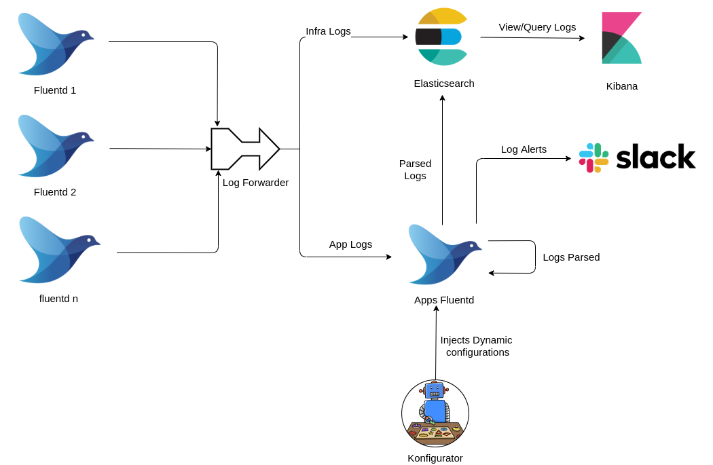

# Logging

Stakater App Agility Platform uses EFK Stack (Elasticseatch Fluentd Kibana) to provide logging for applications. Flunetd daemonsets pick up the logs and send these to elasticsearch. Kibana dashboards can be used to view/analyze logs




## Parse JSON Application Logs

Logs are parsed by default if applications output logs in `JSON format` on stdout. Moreover one step nested JSON parsing is also supported additionally.

Consider the following example of a one line event by a java application:
```json
{"timestamp":"2021-04-15 11:41:01.427","level":"WARN","thread":"http-nio-8080-exec-4","mdc":{"breadcrumbId":"441ce707-8096-4aba-a927-0afa8c34802b-by-BOKE","user":"service-account-boke"},"logger":"org.zalando.logbook.Logbook","message":"{\"origin\":\"local\",\"type\":\"response\",\"correlation\":\"ef4f3737f2bcf856\"}"}
```

This will be parsed as follows:
```json
{
    "timestamp":"2021-04-15 11:41:01.427",
    "level":"WARN",
    "thread":"http-nio-8080-exec-4",
    "mdc.breadcrumbId":"441ce707-8096-4aba-a927-0afa8c34802b-by-BOKE",
    "mdc.user":"service-account-boke",
    "logger":"org.zalando.logbook.Logbook",
    "message":"{\"origin\":\"local\",\"type\":\"response\",\"correlation\":\"ef4f3737f2bcf856\"}",
    "origin": "local",
    "type": "response",
    "correlation": "ef4f3737f2bcf856"
}
```
)

## Parse non JSON Application Logs

Parsing application logs which are not in `JSON format` can be done as follows:

Consider the following example of a one line event by a java application: 

```
2019-11-27 11:04:12.682  INFO 1 --- [nio-8080-exec-1] o.s.web.servlet.DispatcherServlet        : Initializing Servlet 'dispatcherServlet'
```
The configuration to parse/match/send logs can be specified in the [Application Chart](https://github.com/stakater-charts/application) , by specifying regexes as described below:

| Parameter | Description |
|:---|:---|
|.Values.deployment.fluentdConfigAnnotations.regexFirstLine|specify the regex to match the first line of the log|
|.Values.deployment.fluentdConfigAnnotations.regex|specify the regex to parse the complete log entry|
|.Values.deployment.fluentdConfigAnnotations.timeFormat|specify the regex to parse time|

Use the following Configuration for parsing java springboot logs :

```yaml
deployment:
  fluentdConfigAnnotations:
    regex: /^(?<time>\\d+(?:-\\d+){2}\\s+\\d+(?::\\d+){2}\\.\\d+)\\s*(?<level>\\S+)
      (?<pid>\\d+) --- \\[(?<thread>[\\s\\S]*?)\\] (?<class>\\S+)\\s*:\\s*(?<message>[\\s\\S]*?)(?=\\g<time>|\\Z)/
    regexFirstLine: /^\\d+(?:-\\d+){2}\\s+\\d+(?::\\d+){2}\\.\\d+/
    timeFormat: "%Y-%m-%d %H:%M:%S.%L"
```

This will be parsed as follows:

```
time: 2019-11-27 11:04:12.682
level: INFO
pid: 1
thread: nio-8080-exec-1
class: o.s.web.servlet.DispatcherServlet
message: Initializing Servlet 'dispatcherServlet'
```

## Log Retention

By default Application logs are retained for 7 days.

## Application alerting

Alerts can be sent to slack channels by matching a string against a particular field. e.g. Send an alert to slack if `level`==`ERROR`. These alerts increase operational efficiency. See [Application log alerting](../alerting/log-alerts.md#Application-Logs-Alerting) on how to configure alerts