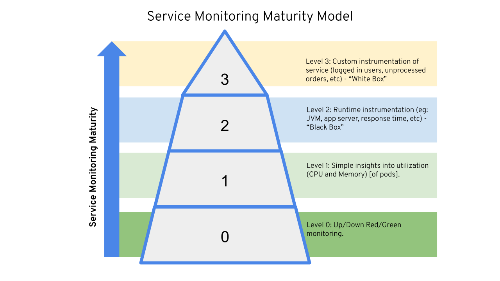

# Service Monitoring Maturity Model

Stakater App Agility Platform supports all four levels in service moniotoring maturity model.

## Level 0
Level 0: Up/Down Red/Green monitoring.

## Level 1
Level 1: Simple insights into utilization (CPU and Memory) of pods.

## Level 2
Level 2: Runtime instrumentation (eg: JVM, app server, response time, etc) -“Black Box”.

## Level 3
Level 3: Custom instrumentation of service (logged in users, unprocessed orders, etc) -“White Box”.
