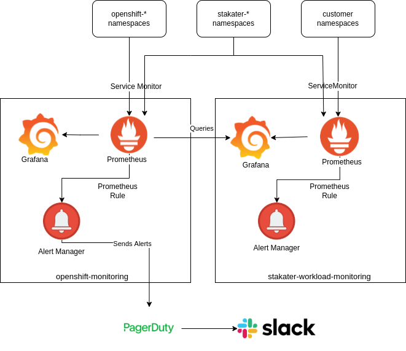

# Creating Application Alerts

## Overview
There are 2 types of monitoring:

1. InfraStructure monitoring (comes default with openshift installation)
2. Workload monitoring ( deployed by stakater to monitor application workloads)




## Infrastructure Monitoring
1. Prometheus
2. Grafana
3. AlertManager

## Workload Monitoring
1. Prometheus
2. Grafana
3. (No Alertmanager. Alerts forwarded to Infrastructure's AlertManager)

## Creating Application Alerts to Monitor Application workloads
In order to define Prometheus rules to monitor applications on the basis of exposed metrics. You need 3 things:

1. Metrics Exposed by Application endpoints
2. Metrics endpoints are scraped via ServiceMonitor
3. Defining PrometheusRule CustomResource

### Metrics Exposed by the Application

Prometheus metrics can be exposed on any endpoint from the application (usually `/metrics`)

### Metrics endpoints are scraped via ServiceMonitor

Metrics endpoints are then scraped via ServiceMonitors and sent to workload Prometheus

Example ServiceMonitor:

```yaml
apiVersion: monitoring.coreos.com/v1
kind: ServiceMonitor
metadata:
  name: example-svc-monitor
  namespace: example-namespace
spec:
  endpoints:
  - interval: 30s
    path: /metrics
    port: metrics
  selector:
    matchLabels:
      app: example-svc-label
```

### Defining PrometheusRule CustomResource

PrometheusRule CustomResource will define rules to generate an alert if the metrics values go below/up a certain value (depends on the usecase).

The Template for the File is as follows:

```yaml
apiVersion: monitoring.coreos.com/v1
kind: PrometheusRule
metadata:
  labels:
    prometheus: stakater-workload-monitoring
    role: alert-rules
  name: <NAME_OF_PROMETHEUSRULE>
  namespace: stakater-workload-monitoring
spec:
  groups:
  - name: <GROUP_NAME> 
    rules:
    - alert: <ALERT_NAME>
        Message: >-
          <MESSAGE_TO_BE_DISPLAYED>
        expr: >-
          <EXPRESSION_TO_BE_EVALUATED_FOR_ALERT>
        for: <TIME_FOR_WHICH_THE_EXPRESSION_IS_TRUE>
        labels:
          severity: <SEVERITY>
```

Following Example shows Alerts for PersistentVolumes on the metrics scraped from Kubelets

```yaml
apiVersion: monitoring.coreos.com/v1
kind: PrometheusRule
metadata:
 labels:
   prometheus: stakater-workload-monitoring
   role: alert-rules
 name: prometheus-workload-rules
 namespace: stakater-workload-monitoring
spec:
 groups:
   - name: kubernetes-storage
     rules:
       - alert: KubePersistentVolumeUsageCritical
         annotations:
           message: >-
             The PersistentVolume claimed by {{ $labels.persistentvolumeclaim
             }} in Namespace {{ $labels.namespace }} is only {{ $value |
             humanizePercentage }} free.
         expr: >-
           kubelet_volume_stats_available_bytes{namespace!~"(openshift-.*|kube-.*|default|logging)",job="kubelet"}
             /
           kubelet_volume_stats_capacity_bytes{namespace!~"(openshift-.*|kube-.*|default|logging)",job="kubelet"}
             < 0.03
         for: 1m
         labels:
           severity: critical
       - alert: KubePersistentVolumeFullInFourDays
         annotations:
           message: >-
             Based on recent sampling, the PersistentVolume claimed by {{
             $labels.persistentvolumeclaim }} in Namespace {{ $labels.namespace
             }} is expected to fill up within four days. Currently {{ $value |
             humanizePercentage }} is available.
         expr: >-
           (
             kubelet_volume_stats_available_bytes{namespace!~"(openshift-.*|kube-.*|default|logging)",job="kubelet"}
               /
             kubelet_volume_stats_capacity_bytes{namespace!~"(openshift-.*|kube-.*|default|logging)",job="kubelet"}
           ) < 0.15
 
           and
 
           predict_linear(kubelet_volume_stats_available_bytes{namespace!~"(openshift-.*|kube-.*|default|logging)",job="kubelet"}[6h],
           4 * 24 * 3600) < 0
         for: 1h
         labels:
           severity: critical
       - alert: KubePersistentVolumeErrors
         annotations:
           message: >-
             The persistent volume {{ $labels.persistentvolume }} has status {{
             $labels.phase }}.
         expr: >-
          kube_persistentvolume_status_phase{phase=~"Failed|Pending",namespace!~"(openshift-.*|kube-.*|default|logging)",job="kube-state-metrics"}
           > 0
         for: 5m
         labels:
           severity: critical
```

## Useful Links

- [Alerting Rules](https://prometheus.io/docs/prometheus/latest/configuration/alerting_rules/)
- [Template Examples](https://prometheus.io/docs/prometheus/latest/configuration/template_examples/)
- [Template Reference](https://prometheus.io/docs/prometheus/latest/configuration/template_reference/)
