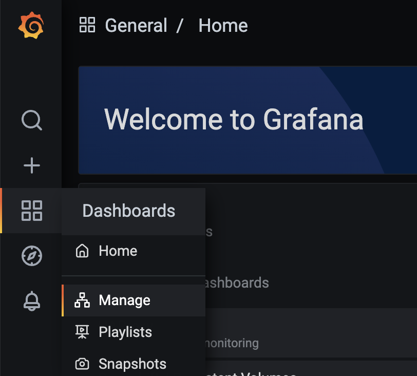
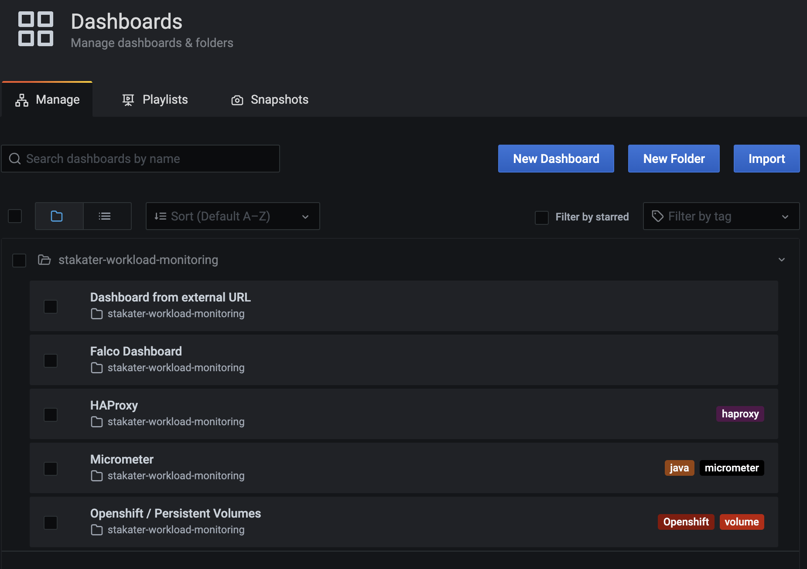

# Create Grafana Dashboard Guide

This document explains how to create Grafana Dashboard via GrafanaDashboard CR powered by grafana operator. In this way there is no need to configure via web UI. And developers are able to ship new dashboards in any namespace and deploy them via gitops. If Dashboard definition is invalid, the dashboard will not appear in grafana web UI.

## Prerequisite 

- Grafana operator is in up and running configured via Stakater.

## Instructions  

1) Create GrafanaDashboard definition 

   The namespace can be anyone you desire, but must be present. The label “grafanaDashboard: grafana-operator” is required for grafana operator to discover the dashboard. The json string with the dashboard contents is placed in the “json” section. Check the [official documentation](https://grafana.com/docs/reference/dashboard/#dashboard-json) for details on JSON Model. You are able to create a dashboard via web UI first, and then export the json string to define the GrafanaDashboard CR. If the json string is invalid, the dashboard will not appear in grafana web UI.

```yaml
apiVersion: integreatly.org/v1alpha1
kind: GrafanaDashboard
metadata:
  name: grafana-dashboard-example
  namespace: test-ns
  labels:
    grafanaDashboard: grafana-operator
spec:
  json: |-
    {
      "annotations": {
        "list": [
          {
            "builtIn": 1,
            "datasource": "-- Grafana --",
            "enable": true,
            "hide": true,
            "iconColor": "rgba(0, 211, 255, 1)",
            "name": "Annotations & Alerts",
            "type": "dashboard"
          }
        ]
      },
      "editable": true,
      "gnetId": null,
      "graphTooltip": 0,
      "id": null,
      "links": [],
      "panels": [
        {
          "aliasColors": {},
          "bars": false,
          "dashLength": 10,
          "dashes": false,
          "datasource": null,
          "fieldConfig": {
            "defaults": {},
            "overrides": []
          },
          "fill": 1,
          "fillGradient": 0,
          "gridPos": {
            "h": 9,
            "w": 12,
            "x": 0,
            "y": 0
          },
          "hiddenSeries": false,
          "id": 2,
          "legend": {
            "avg": false,
            "current": false,
            "max": false,
            "min": false,
            "show": true,
            "total": false,
            "values": false
          },
          "lines": true,
          "linewidth": 1,
          "nullPointMode": "null",
          "options": {
            "alertThreshold": true
          },
          "percentage": false,
          "pluginVersion": "7.5.11",
          "pointradius": 2,
          "points": false,
          "renderer": "flot",
          "seriesOverrides": [],
          "spaceLength": 10,
          "stack": false,
          "steppedLine": false,
          "thresholds": [],
          "timeFrom": null,
          "timeRegions": [],
          "timeShift": null,
          "title": "Panel Title",
          "tooltip": {
            "shared": true,
            "sort": 0,
            "value_type": "individual"
          },
          "type": "graph",
          "xaxis": {
            "buckets": null,
            "mode": "time",
            "name": null,
            "show": true,
            "values": []
          },
          "yaxes": [
            {
              "format": "short",
              "label": null,
              "logBase": 1,
              "max": null,
              "min": null,
              "show": true
            },
            {
              "format": "short",
              "label": null,
              "logBase": 1,
              "max": null,
              "min": null,
              "show": true
            }
          ],
          "yaxis": {
            "align": false,
            "alignLevel": null
          }
        }
      ],
      "schemaVersion": 27,
      "style": "dark",
      "tags": [],
      "templating": {
        "list": []
      },
      "time": {
        "from": "now-6h",
        "to": "now"
      },
      "timepicker": {},
      "timezone": "",
      "title": "New dashboard",
      "uid": null,
      "version": 0
    }
```

2. Apply GrafanaDashbaord CR to your cluster, manualy or via gitops way 

2) View the dashboard via grafana web UI

   1. Under "stakater-workload-monitoring" project, find the url to grafana through Cluster menu [Networking]->[Routes]
   2. Open grafana web UI, and go to [Dashboards]->[Manage] to view Dashbaords management page
      
   
   3. Your dashboard will be put in a folder named after the namespace that you specified in GrafanaDashboard definition. The following is an example. 
   

## Application chart

A template for installing GrafanaDashboard is provided by application chart. You are able to specify configuration via values.yaml and install dabashboards on cluster. The following is an example.

```yaml
grafanaDashboard:
  enabled: true
  additionalLabels:
    test-label: chart
  annotations: 
    test-annoation: chart
  contents:
    dashboard-test-name-1: 
      json: |-
        {
          ...
        }
```

