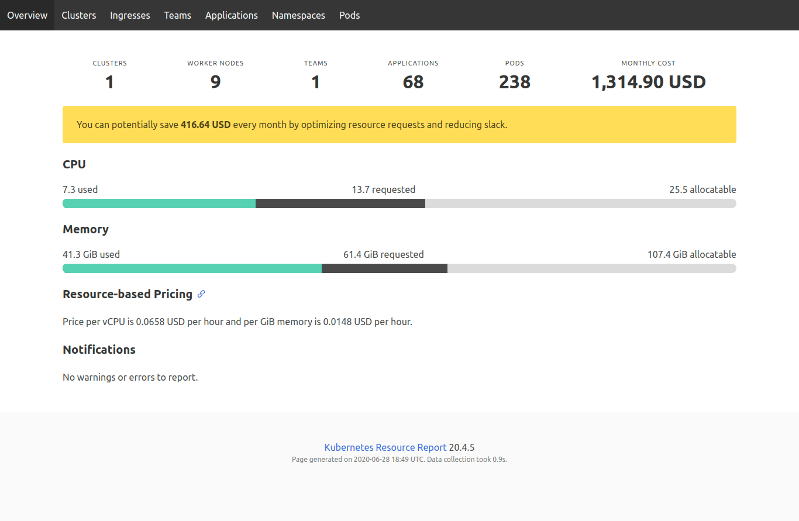
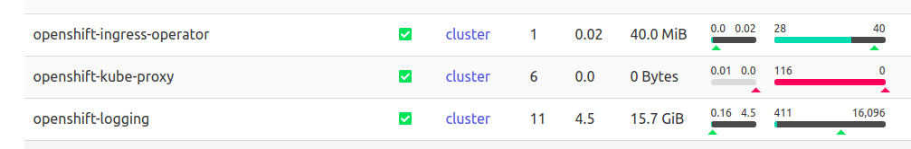

# Resource monitoring using Kube Resource Report

The primary goal of Kube Resource Report is to help optimize Kubernetes resource requests and avoid `Slack` by watching the pods running in the cluster and compares the requests given to the pods and the actual utilization.

`Slack` is the difference between resource requests and resource usage/recommendation, e.g. requesting 2 GiB of memory and only using 200 MiB would mean 1.8 GiB of memory slack — i.e. 1.8 GiB of memory capacity are blocked (and paid for), but unused.

## How it works

- Discovers all cluster resources (either via in-cluster serviceAccount, or via custom Cluster Registry REST endpoint)
- Group and aggregate resource usage and slack costs per `team` and `application`

## Views
Kube Resource Report has multiple views and resources can be categorized on the basis of:

1. Teams (grouped via `team` label on the pods)
2. Applications (grouped via `application` or `app` label on pods)
3. Namespaces
4. Pods
5. Nodes

Kube Resource Report categorizes these resources on the basis of defined labels. In order to change default labels override environment variables as defined in the section [here](https://github.com/hjacobs/kube-resource-report#settings)

Following is an example view of resources and utilization per namespaces

## Resource Recommendations

Recommendations for reource allocations can suggested for each pod via two methods 

- If defined then read and show VerticalPodAutoscaler (VPA) resource recommendations
- Calculate own CPU/memory resource recommendations with a decaying exponential histogram

## Cost Estimation
On the basis of current utilization and Slack Kube resource report can estimate how much cost can be saved if the recommendations are to be applied.

Curently only `AWS` and `Google Cloud` is supported

`AWS`: AWS EC2 (all regions, On Demand, Linux)

`GKE`: All machine types (all regions, On Demand, without sustained discount)

## Useful Links

- [Github Repo](https://github.com/hjacobs/kube-resource-report)