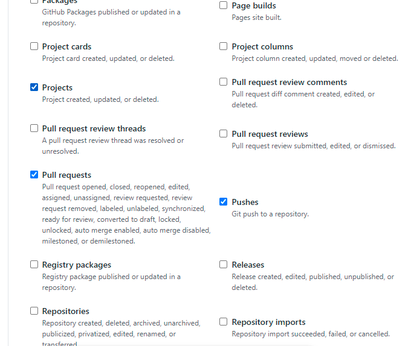

# Add new application

This guide covers the steps to set up a new project/application/microservice in gitops-config repository.

To onboard a new application you need to make following changes:

1. add helm files to application repository
2. add dockerfile to application repository
3. add webhook to application repository 
4. add few files to gitops-config repository

Following are the changes you need to make in order to on-board a new application.

Replace angle brackets with following values in below templates:

  - \<tenant> : Name of the tenant
  - \<application> : Name of git repository of the application
  - \<env>:  Environment name
  - \<gitops-repo>:  url of your gitops repo
  - \<nexus-repo>: url of nexus repository

## 1. Add helm files to application repo

In application repo add helm chart in ***deploy*** folder at the root of your repository. To configure helm chart add following 2 files in ***deploy*** folder.

We use [stakater application](https://github.com/stakater-charts/application/tree/master/application) chart as our main chart.

1. Chart.yaml
2. values.yaml

- Chart.yaml

```yaml 
apiVersion: v2
name: <application>
description: A Helm chart for Kubernetes
dependencies:
- name: application
  version: 0.0.*
  repository: https://stakater.github.io/stakater-charts  

type: application

version: 0.1.0
```

- values.yaml

Configure helm values as per application needs.

```yaml
application:
  # application name should be short so limit of 63 characters in route can be fulfilled. Default route name formed is <application-name>-<namespace>.<base-domain>
  applicationName: <application>
  space:
    enabled: true
  deployment:
    image:
      repository: DOCKER_REPOSITORY_URL
      tag: IMAGE_TAG
    imagePullSecrets: "nexus-docker-config-forked"
    # Resource request/limits
    resources:
      limits:
        memory: 512Mi
        cpu: 0.2
      requests:
        memory: 256Mi
        cpu: 0.2
    # Liveness and Readiness probes
    probes: 
      readinessProbe:
        failureThreshold: 3
        periodSeconds: 20
        successThreshold: 1
        timeoutSeconds: 5
        initialDelaySeconds: 5
        httpGet:
          path: /
          port: 8080
      livenessProbe:
        failureThreshold: 3
        periodSeconds: 20
        successThreshold: 1
        timeoutSeconds: 5
        initialDelaySeconds: 5
        httpGet:
          path: /
          port: 8080
    # Environment variables
    env: []
  # Role Based Access Control
  rbac:
    enabled: true
    serviceAccount:
      enabled: true
  # Service configuration
  service:
    ports:
    - port: 8080
      name: http
      targetPort: 8080
  # Openshift Routes
```

## 2. Add dockerfile to application repository

SAAP ships with few generic tekton pipelines for quick jump start; all those pipelines expect to have Dockerfile in the root of the repository. Dockerfile should handle both build and package part; we typically use mutli-stage Dockerfiles with 2 steps; one for build and another for run e.g.

```
## BUILD
FROM maven:3.6.3-openjdk-11-slim AS build
COPY src /usr/src/app/src
COPY pom.xml /usr/src/app
RUN mvn -f /usr/src/app/pom.xml clean package

## RUN
FROM registry.access.redhat.com/ubi8/openjdk-8

LABEL name="review" \
      maintainer="Stakater <hello@stakater.com>" \
      vendor="Stakater" \
      release="1" \
      summary="Java Spring boot application"

# Set working directory
ENV HOME=/opt/app
WORKDIR $HOME

# Expose the port on which your service will run
EXPOSE 8080

# NOTE we assume there's only 1 jar in the target dir
COPY --from=build /usr/src/app/target/*.jar $HOME/artifacts/app.jar

USER 1001

# Set Entrypoint
ENTRYPOINT exec java $JAVA_OPTS -jar artifacts/app.jar
```

The idea is to avoid having different pipelines for different applications and if possible do stuff in dockerfiles but there can b cases where one might need to language specific pipelines.

Customers can do the way they like; as we ship few generic tekton pipelines just for the sake of jump start.

We do have a separate offering `Pipeline as a Service`; in which we completely manage all sorts (generic and specific) of tekton pipelines; reach out to sales@stakater.com for more information.

## 3. Add webhook to application repository

Add webhook to the application repository; you can find the webhook URL in the routes of the `build` namespace; for payload you need to include the `pull requests` and `pushes` with ContentType `application/json`.

### GitHub

For GitHub add following to the payload.



### Gitlab

_TODO_

### Bitbucket

_TODO_

## 4. Add files to gitops-config repository

You need to create application folder inside a tenant. Inside application folder you need to create each environment folder that application will be deployed to. Following folders will be created.

- \<tenant>/\<application>
- \<tenant>/\<application>/\<01-env>
-  \<tenant>/\<application>/\<02-env>
-  \<tenant>/\<application>/\<0n-env>

To deploy, you'll need to add helm chart of your application in **each** environment folder.

Add values of helm chart that are different from  default values at ```deploy/values.yaml```  defined in application repository

Templates for the files:

- \<tenant>/\<application>/\<env>\values.yaml: 

``` yaml
<application>:
  application:
    space:
      enabled: false
    deployment:
      image:
        repository: <nexus-repo>/<tenant>/<application>
        tag: v0.0.1
```

- \<tenant>/\<app>/\<env>\Chart.yaml: 

``` yaml
apiVersion: v2
name: <application>
description: A Helm chart for Kubernetes
dependencies:
- name: <application>
  version: 0.0.*
  repository: <nexus-url> 

type: application

version: 0.1.0

appVersion: 1.0.0

```

- \<tenant>\/configs/\<env>/argocd/\<application>.yaml 

``` yaml
apiVersion: argoproj.io/v1alpha1
kind: Application
metadata:
  name: <tenant>-<env>-<application>
  namespace: openshift-stakater-argocd
spec:
  destination:
    namespace: <tenant>-<env>
    server: 'https://kubernetes.default.svc'
  source:
    path: <tenant>/<application>/<env>
    repoURL: '<gitops-config>'
    targetRevision: HEAD
  project: <tenant>-<env>
  syncPolicy:
    automated:
      prune: true
      selfHeal: true
```
