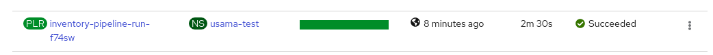
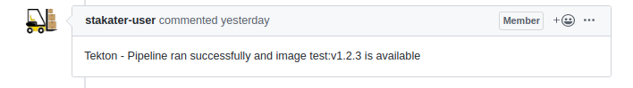
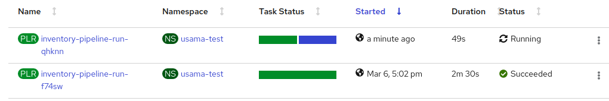

# Deploying CI/CD Pipeline

# Workflow


# Pre-requisites

Set-up everything from `Deploying Delivery Pipeline` but don't run the last step i.e create pipeline run. We will be using
triggers for automation now.

## Create WebHook Secrets

::: details Provide `GithubToken` created in section `1.1` as a base64 encoded string.
```bash
vi webhooks/secrets/webhook-secret.yaml
```
:::


::: details Create secret
```bash
kubectl apply -f webhooks/secrets/webhook-secret.yaml -n <NAMESPACE_NAME>
```
:::


## Create Webhooks

::: details Update Namespace value for unique webhooks. 
```bash
# replace the <NAMESPACE_NAME> with your namespace
sed -i "s/NAMESPACE_NAME/<NAMESPACE_NAME>/g" webhooks/taskrun-webhook.yaml
```
:::

::: details Update Username value for creating a webhook in your forked repo. 
```bash
# replace the <USERNAME> with your namespace
sed -i "s/USERNAME/<USERNAME>/g" webhooks/taskrun-webhook.yaml
```
:::

::: details Create Webhooks so that the pipelines get triggered on new PRs.
```bash
kubectl apply -f webhooks/. -n <NAMESPACE_NAME>
```
:::

## Create Triggers

::: details Update Namespace and Username value according to your own namespace.
```bash
# replace the <NAMESPACE_NAME> field with your namespace
sed -i "s/NAMESPACE_NAME/<NAMESPACE_NAME>/g" triggers/trigger.yaml 
# replace the <USERNAME> field with your username
sed -i "s/USERNAME/<USERNAME>/g" triggers/trigger.yaml 
```
:::

::: details Create trigger resources
```bash
kubectl apply -f triggers/trigger.yaml -n <NAMESPACE_NAME>
```
:::

## Test Route

::: details Verify EventListener Route created in your namespace

On Openshift Dashboard, On the left panel, Go to `Networking` -> `Routes` and verify an event listener route is created. 

Verify by Opening the URL under `Location` and verify the response is similar to this:
```
{"eventListener":"inventory-eventlistener","namespace":"<NAMESPACE>","eventID":"cx8n4"}
```
:::

## CI - Create A PR in the Forked Repository

Now attempt to make a PR in your forked repository. which will trigger an automated build.

::: details Create a PR and verify its status

- Create a PR for the forked repo by adding a `test_file.txt` with some random text in a branch `test-branch`

- As soon as the PR is created Pipeline will be triggered which can be seen in Openshift dashboard under `Pipeline` -> `Pipeline Runs`

- On successful build, the status would be shown as follows



- A comment will be posted on the PR on Github to reflect the status of the Pipeline


:::

## CD - Merge this PR into the master

Now attempt to merge this PR in master

::: details Merge PR in master

- Merge the Pull Request in the master to rigger the pipeline on master branch



- After successful execution a new release and tag will be created in the `Releases` section on Github


:::

## Verify new Image

Verify that the new image is available in your registry


## Verify new Tags

::: details Verify forked repository to new newly pushed tag


:::