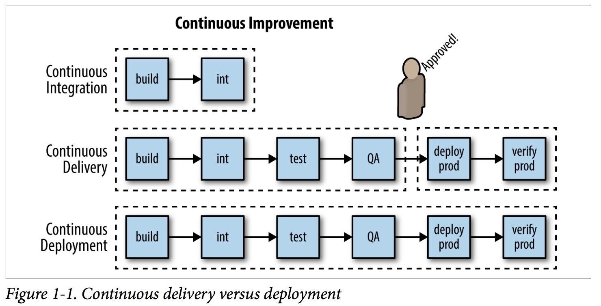

# Introduction

Pipelines are a representation of the flow/automation in a CI/CD process. Typically, a pipeline might call out discrete
 steps in the software delivery process and present them visually or via a high-level scripting language so the flow can 
 be manipulated. The steps might include build, unit tests, acceptance tests, packaging, documentation, reporting, and 
 deployment and verification phases. Well-designed pipelines help deliver better quality code faster by enabling 
 participants in the software delivery process to more easily diagnose and respond to feedback.
 
The CI/CD pipeline is one of the best practices for teams to implement, for delivering code changes more 
frequently and reliably. CI/CD pipelines embody a culture, set of operating principles, and collection of practices that 
enable application development teams to deliver code changes more frequently and reliably. 

## Continuous Integration

Continuous integration (CI) concerns the integration of code from potentially multiple authors into a shared source code
 management (SCM) repository. Such check-ins could occur many times a day, and automation steps in such a process could 
 include gates or controls to expose any issues as early as possible. SCMs such as Git include workflow support to 
 commit to trunk, push, and merge code pull requests from multiple developers. With containers, a Git push event could 
 be configured to then trigger an image build event via the webhooks mechanism.
 
## Continuous Delivery
Once a CI strategy is in place, consideration can then move to achieving continuous delivery (CD).
 This involves automating the steps required to promote the work product from one environment to the next within the 
 defined software development lifecycle (SDLC). Such steps could include automated testing, smoke, unit, functional, 
 and static code analysis and static dependency checks for known security vulnerabilities. With containers, promotion in
  later stages of the SLC may merely involve the tagging of the (immutable) image to mark acceptance. 
  Binary promotions are also possible such that only the image is pushed (to the target registry of the new environment), 
  leaving source code in situ.
  
## Continuous Deployment

By convention, we can denote the special case of automated continuous delivery to production as continuous deployment (CD).
 We make such a distinction because such deployments may be subject to additional governance processes and gates—for 
 example, deliberate human intervention to manage risk and complete sign-off procedures. We make such a distinction 
 because such deployments may be subject to additional governance processes.

