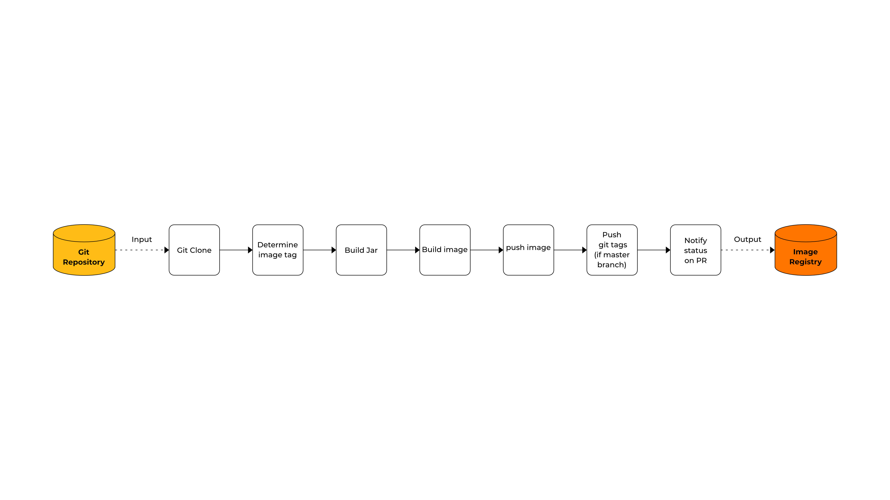

# Deploying Delivery Pipeline

# Workflow



[[toc]]

# Pre-requisites

This section provides the pre-requisite steps for this workshop

## Fork Repository

::: details Go to the following URL and fork the repo

[Stakater-nordmart-inventory Repository](https://github.com/stakater-lab/stakater-nordmart-inventory) 


:::

## Create Personal Access Token

A Personal Access Token would be required to perform steps in a Tekton Pipeline

::: details Login to your Gihub account and generate a Personal Access Token via this follwoing URL:

`https://github.com/settings/tokens/new`

Access needed for the token are:
- `repo`
- `admin:repo_hook`


:::

## Create Project

`oc new-project NAMESPACE_NAME`

## Deploy Inventory Microservice

Save the manifest, will be used going forward, and deploy inventory microservice in your namespace

::: details 1.3.1 Download Manifest

[Inventory Manifest](https://raw.githubusercontent.com/stakater-lab/stakater-nordmart-inventory/master/deployment/manifests/application/inventory.yaml) 
```bash
oc apply -f https://raw.githubusercontent.com/stakater-lab/stakater-nordmart-inventory/master/deployment/manifests/application/inventory.yaml -n NAMESPACE_NAME
```
:::

# Delivery Pipeline

This section will provide step by step instructions to run a Delivery pipeline using Tekton:

## Clone Repository

::: details Clone the repository
```bash
git clone https://github.com/stakater/stakater-pipeline-library.git
```
Switch directory:
```bash
cd stakater-pipeline-library/tekton-pipelines/
```
:::

## Apply RBAC (Role Based Access Control) 

::: details Apply necessary rbac resources for the pipeline
```bash
oc apply -f tekton-builder-rbac.yaml -n <NAMESPACE_NAME>
oc apply -f tekton-create-webhook-rbac.yaml -n <NAMESPACE_NAME>
```
:::

## Replace Placeholders

1. Replace place holders NAMESPACE_NAME, USERNAME, DOMAIN and REGISTRY_URL
2. Update secrets and provide relevant values

## Create Secrets for Pipeline

These secrets will be required to access github and container registry during the pipeline

::: details 3.2.1 Provide Github Credentials

Configure Tekton pipeline to access GitHub by the secret: `secret-github-credentials.yaml`
```bash
vi secrets/secret-github-credentials.yaml
```

Provide base64 encoded `username`, `email` and `password` of Github account in the given fields respectively.

::: tip TIP: Convert text to base64
```bash
echo -n "YOUR_TEXT" | base64 
```
:::

::: details 3.2.2 Apply Secrets
Apply Secrets
```bash
oc apply -f secrets/. -n <NAMESPACE_NAME>
```
:::

## Create Resources, Tasks, Pipelines, Conditions

::: details Create `PipelineResource, Task, Pipeline, Conditions` 
```bash
oc apply -f resources/ -n <NAMESPACE_NAME>
oc apply -f tasks/ -n <NAMESPACE_NAME>
oc apply -f pipelines/ -n <NAMESPACE_NAME>
oc apply -f conditions/ -n <NAMESPACE_NAME>
```
::: 

## Run Pipeline

::: details Run Pipeline via creating a `PipelineRun` resource to trigger the pipeline
```bash
oc apply -f pipelinerun/pipeline-run.yaml -n <NAMESPACE_NAME>
``` 
:::


## Verify Pipeline
::: details Verify the triggered Pipeline from the dashboard on the Left Pane
`Pipeline Runs` -> `inventory-pipeline`


:::

## Verify new Image

Verify that the new image is available in your registry


## Verify new Tags
::: details Verify forked repository to new newly pushed tag


:::

## Note

In case of `openshift-registry` the REGISTRY_URL will be `image-registry.openshift-image-registry.svc:5000/NAMESPACE_NAME`.
Also, there is no need to add registry credentials in that case because we'll add registry-editor role to our service account
using `oc policy add-role-to-user registry-editor -z stakater-tekton-builder`
