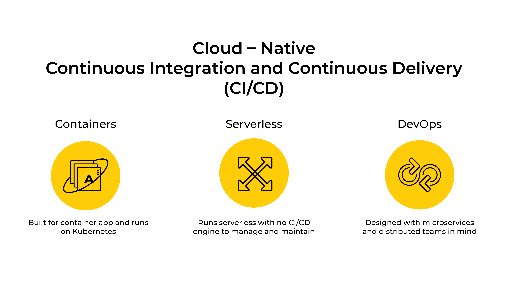
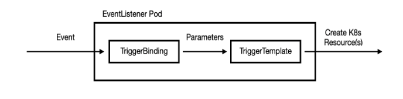

# Introduction

OpenShift Pipelines is a cloud-native, continuous integration and delivery (CI/CD) solution for building pipelines using
 Tekton. Tekton is a flexible, Kubernetes-native, open-source CI/CD framework that enables automating deployments across 
 multiple platforms (Kubernetes, serverless, VMs, etc) by abstracting away the underlying detail.

 
[Tekton](https://github.com/tektoncd/pipeline#-tekton-pipelines) is a standalone project that provides an open, standard and native Kubernetes CI/CD solution.

Main goals:
1. Faster
2. Declarative
3. Reproducible
4. Cloud Native

## Openshift Pipeline Benefits

1. Kubernetes native pipelines
2. Runs pipelines in containers
3. Runs server-less
4. Build images with Kubernetes tools
5. Deploy to multiple platforms
6. Developer tools
7. Decoupled

## Tekton Concepts

Tekton defines a number of Kubernetes custom resources as building blocks in order to standardize pipeline concepts and 
provide a terminology that is consistent across CI/CD solutions:

- Step: Smallest unit of execution that defines kubernetes container spec
- Task: Run commands within container
- Task Run: Runtime representation of an execution of a task
- Pipeline Resources: Acts as input or output to tasks and pipelines. Example, source code, container image, pull request etc.
- Pipeline: Runs tasks in a defined order based on inputs and outputs
- Pipeline Run: Runtime representation of an execution of a pipeline
- Conditions: Conditional tasks in pipeline

## Pipeline Workflow

## Continuous Integration/Delivery

For Continuous Integration/Delivery we can use triggers and webhooks:

1. Webhook: Send payload to event-listener whenever a push event or a pull request is created. [More on webhooks](https://developer.github.com/webhooks/)
2. Triggers: 
    - Event Listeners: Listen to events over a route
    - Trigger Templates: Templatized PipelineResources & PipelineRun based on event
    - Trigger Bindings: Extract info out of payload to be used in trigger templates 
    - Interceptors: Filtration of events and payload
    
### Trigger Workflow

## Openshift Pipelines Catalog - Reusable Tasks

- [Official](https://github.com/tektoncd/catalog)
- [Kabanero-io](https://github.com/kabanero-io/kabanero-pipelines/tree/master/pipelines)
- [Openshift](https://github.com/openshift/pipelines-catalog)
- [Open-toolchain](https://github.com/open-toolchain/tekton-catalog)
- [Redhat-developer-demos](https://github.com/redhat-developer-demos/pipelines-catalog)

## Useful Resources

- [Tektoncd](https://github.com/tektoncd)
- [Openshift Pipelines](https://github.com/openshift-pipelines)
- [Pipeline Examples](https://github.com/tektoncd/pipeline/tree/master/examples)
- [Katacoda Course](https://www.katacoda.com/openshift/courses/middleware/pipelines)
- [Visual Studio Code Tekton Pipelines Extension](https://marketplace.visualstudio.com/items?itemName=redhat.vscode-tekton-pipelines)
