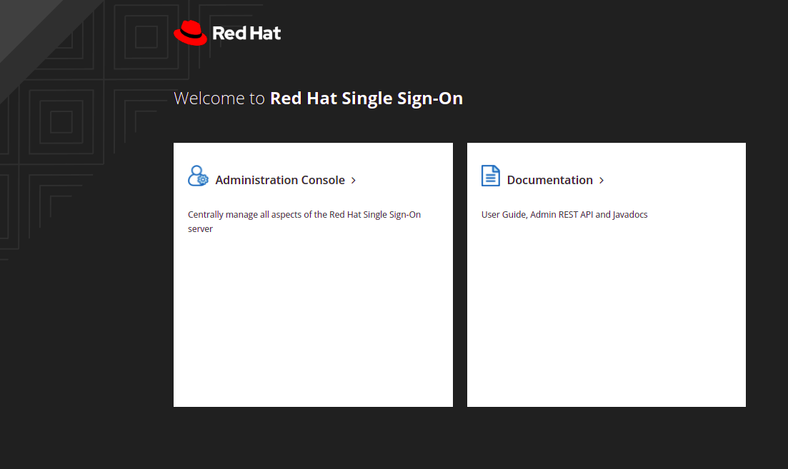

## Granting Admin privilege to user for nexus on Keycloak

- Goto routes in `stakater-auth` namespace , open keycloak route , following screen will show up 

  

- Select Administration Console. Login credentials are present in secret `rhsso-creds` (previously called `auth-secrets`)  in `stakater-auth` namespace
  
  

- Click on `Users` from left panel and click on `view all users button`. Select the user you want to assign admin role to.
  
  

- On Role Mappings screen , select `nexus3` in client roles drop down. 
  
  

- On user screen select Role Mappings tab , `nexus-oauth-admin` role will be present in left most column , select it and click on `Add selected`
  
  

- Role is assigned to user
  
  \

- Now login to nexus repository you will have admin access
  
  