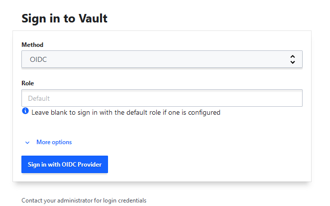
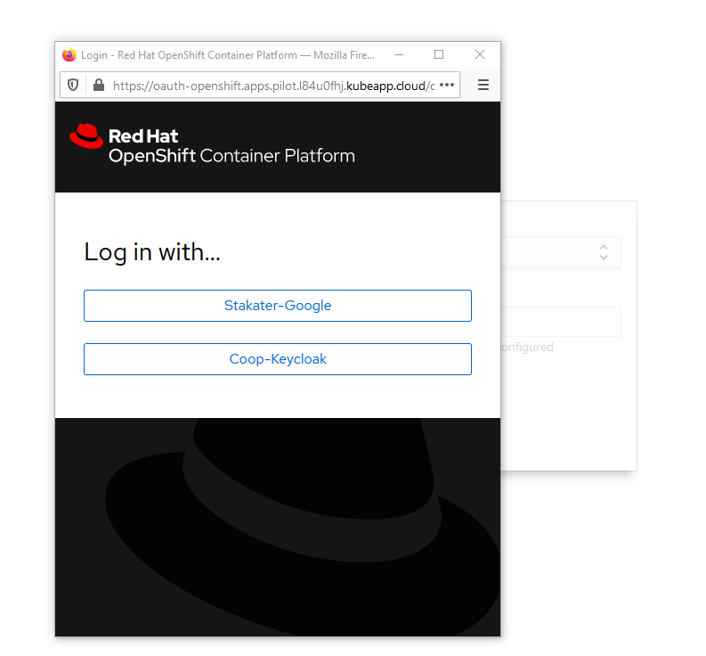
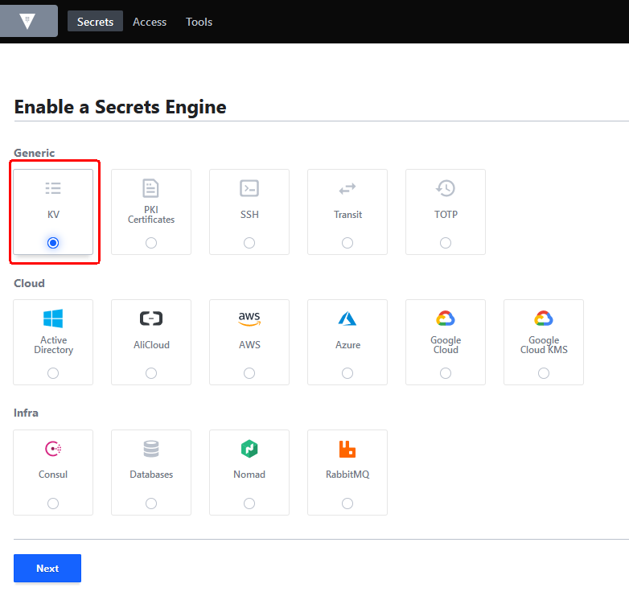
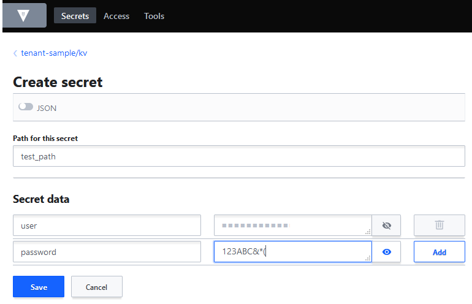
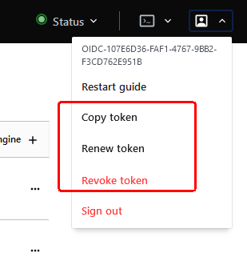
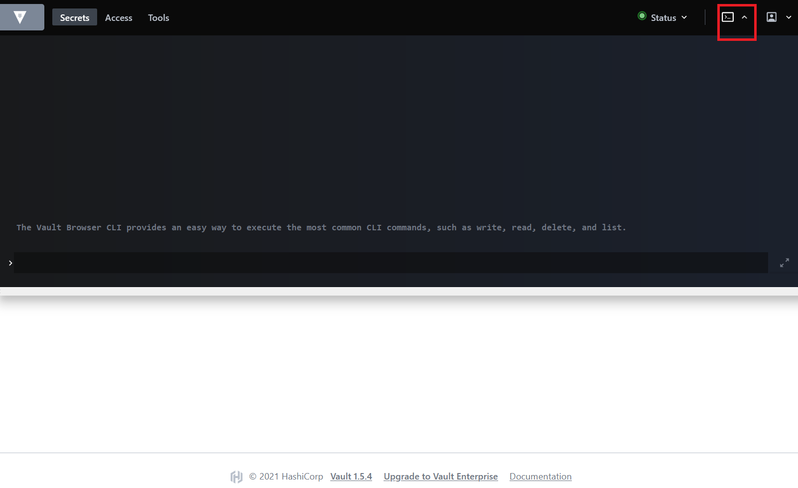

# Vault

[[toc]]

Vault is a tool for securely accessing secrets. A secret is anything that you want to tightly control access to, such as API keys, passwords, or certificates. 
Vault provides a unified interface to any secret, while providing tight access control and recording a detailed audit log.

When you create a secret in kubernetes it is stored in etcd as plain text, also the secret is accessible to anyone that has access to your cluster. Vault solves this issue by providing a central secret management store that provides an additional layer of security using it's authentication methods. Secrets are only accessible when you provide a corresponding token

There are 2 kinds of secrets in the vault:

* Secrets for managed applications provided by Stakater (ex: Nexus repository credential, etc.)
  Users only have read permission.
  The path is `managed-addons/*`.
* Tenant specific secrets.
  A `KV` v2 secret engine is enabled on `TENANT_NAME/kv` path in default. Even though users delete that path, it is created automatically so please don't remove that.
  Users can enable/disable secret engines on `TENANT_NAME/*` paths and create/delete/update/read secrets in them.

Users can manage secrets via vault UI or vault CLI.

## Manage vault secrets via UI

Users included in any tenants can access to the Vault UI using OIDC authentication.

Once login, users can do all actions on the path `TENANT_NAME/*`.

- Enable/disable any kinds of secret engines

- Create/update/get/list/delete secrets

**Authentication**



* Access https://stakater-vault-openshift-stakater-vault.CLUSTER_DOMAIN
* Select `OIDC` method on `Sing in to Vault` page.
* Keep `Role` as default.
* Click `Sign in with OIDC Provider`
* Then login on popup authentication dialog. The browser should allow the popup dialog.



**Enable secret engines**




**Create secrets**



## Manage vault secrets via CLI

To use vault CLI, the token is required. Users can get/renew/revoke the token on the UI. (Click the user account Avatar.)



Once token is fetched, users can use the CLI provided by UI. So there is no need to install vault CLI.




```bash
vault login token=${TOKEN}
```

## Consume vault secrets

SAAP supports 3 different ways to consume secrets from vault:

1. Option # 1 - Consume vault secret via a volume
2. Option # 2 - Consume vault secret via environment variable
3. Option # 3 - Consume vault secret via ExternalSecrets

Below you can find step by step guide to consume via different options.

### Option # 1 - Consume vault secret via a volume

To mount vault secret in a volume do following:

- **Step 1**: Add label in serviceaccount so it can be granted vault read access to secret path

     ```
      serviceAccount:
        enabled: true
        additionalLabels: 
          stakater.com/vault-access: "true"
     ```

- **Step 2**: Enable ```SecretProviderClass``` object in helm values and define key and value path of vault. For example

     ```
     secretProviderClass:
      enabled: true
      name: postgres-secret
      roleName: '{{.Release.Namespace}}'
      objects: 
        - objectName: postgresql-password
          secretPath: gabbar/data/postgres
          secretKey: postgresql-password
     ``` 

- **Step 3**: Define volume in helm values that use above created ```SecretProviderClass```
  
     ```
     deployment:
       volumes: 
         - name: postgres-secret
           csi:
             driver: secrets-store.csi.k8s.io
             readOnly: true
             volumeAttributes:
               secretProviderClass: postgres-secret
     ```
    
- **Step 4**: Now mount this volume in container
  
     ```
     volumeMounts:
     - name: postgres-secret
       readOnly: true
       mountPath: /data/db-creds
     ```

### Option # 2 - Consume vault secret via environment variable

To mount vault secret in an environment variable do following:

- **Step 1**: Enable ```SecretProviderClass``` object in helm values and define key/value path and secret objects in vault. For example

     ```
     secretProviderClass:
      enabled: true
      name: postgres-secret
      roleName: '{{.Release.Namespace}}'
      objects: 
        - objectName: postgresql-password
          secretPath: gabbar/data/postgres
          secretKey: postgresql-password
      secretObjects:
        - data:
          - key: postgres-password
            objectName: postgresql-password
          secretName: postgres-secret
          type: Opaque 
     ``` 
   
   The value of **secretName** will be the name of kubernetes secret

- **Step 2**: Define volume in helm values that use above created ```SecretProviderClass```
  
     ```
     deployment:
       volumes: 
         - name: postgres-secret
           csi:
             driver: secrets-store.csi.k8s.io
             readOnly: true
             volumeAttributes:
               secretProviderClass: postgres-secret
     ```

- **Step 3**: Now mount this volume in container. 
  
     ```
     volumeMounts:
     - name: postgres-secret
       readOnly: true
       mountPath: /data/db-creds
     ```
  
  Volume mount is required in order to create a kubernetes secret.

- **Step 4**: This secret can be used as environment variable 

     ```
     env:
        - name: POSTGRES_PASSWORD
          valueFrom:
             secretKeyRef:
                 name: postgres-secret
                 key: postgres-password
     ```

[Here](https://github.com/stakater-lab/stakater-nordmart-review/blob/main/deploy/values.yaml#L24) is a working example.

Your secret should be available at the path defined above in vault; a change in secret value in vault will automatically restart the application by [Stakater Reloader](https://github.com/stakater/Reloader)
