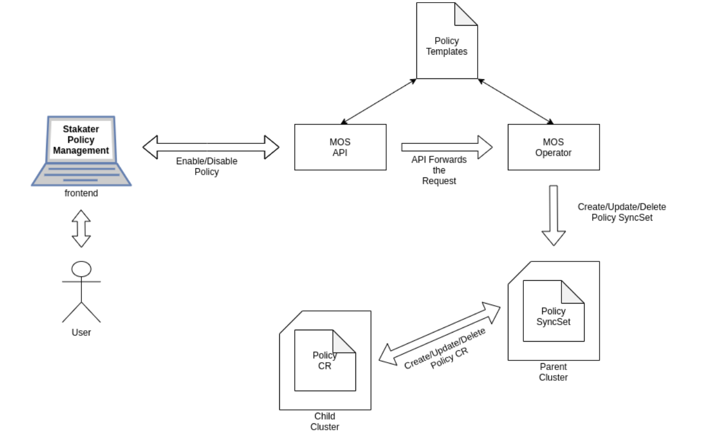

# Policies

## Overview

Policies are resources that govern the behavior of the Kubernetes cluster, where they provide defaults for configuration and also determines what is allowed or disallowed.


## Kyverno

Kyverno is a policy engine designed for Kubernetes. It manages policies as Kubernetes native resources and no new language is required to write policies. This allows using familiar tools such as kubectl, git, and kustomize to manage policies. Kyverno policies can validate, mutate, and generate Kubernetes resources.

## How to write Policies?

[Create custom policy rules to validate, mutate, and generate configurations.](https://kyverno.io/docs/writing-policies)

[For reference: Sample Policies](https://kyverno.io/policies/)

## Architecture Diagram



### Example

```yaml
apiVersion: kyverno.io/v1
kind: Policy
metadata:
  name: require-label-development-team
  annotations:
    policies.kyverno.io/title: Require label Development Team
    policies.kyverno.io/category: Best Practices
    policies.kyverno.io/severity: low
    policies.kyverno.io/subject: Pod
    policies.kyverno.io/description: >-
      Require pods to have development-team label set
spec:
  validationFailureAction: enforce
  rules:
    - name: require-label-development-team
      match:
        resources:
          kinds:
            - Pod
      validate:
        message: "The label `development-team` is required"
        anyPattern:
          - metadata:
              labels:
                development-team: "?*"
```

### Default Policy

Policies that are enforced by default. User cannot disable these policies since they are considered essential for governance, security etc.

## Front-End

A front-end view of how users can manage their policies.


## Kyverno vs OPA Gatekeeper

| Features/Capabilities                       | Gatekeeper | Kyverno        |
| ------------------------------------------- | ---------- | -------------- |
| Validation                                  | ✓          | ✓              |
| Mutation                                    | ✓          | ✓              |
| Generation                                  | X          | ✓              |
| Policy as native resources                  | ✓          | ✓              |
| Metrics exposed                             | ✓          | ✓              |
| OpenAPI validation schema (kubectl explain) | X          | ✓              |
| High Availability                           | ✓          | ✓              |
| API object lookup                           | ✓          | ✓              |
| CLI with test ability                       | ✓          | ✓              |
| Policy audit ability                        | ✓          | ✓              |
| Programming required                        | ✓ (Rego)   | ✓ (Javascript) |

## Useful Links

- [https://kubernetes.io/docs/concepts/policy](https://kubernetes.io/docs/concepts/policy/)
- [OPA Gatekeeper vs. Kyverno](https://www.youtube.com/watch?v=9gSrRNmmKBc)
- [Kyverno Policy Agent](https://thenewstack.io/kyverno-kubernetes-configuration-via-policy/)
