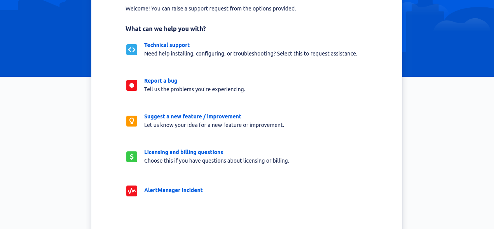
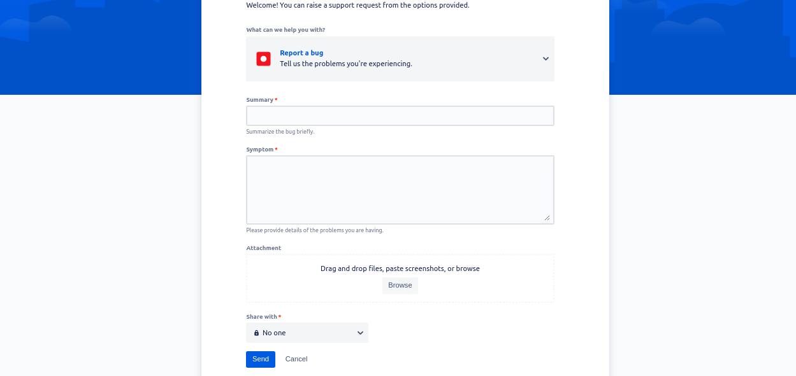

# Getting Support

We provide support to the customers via our [Service Desk Portal](https://stakater-cloud.atlassian.net/servicedesk/customer/portals). You can create Bugs, suggest for improvements/feature request or ask for technical support by creating support tickets on the portal. Users with access only will be able to create support tickets.

## Add Users to Support Portal

If you need to add users to, send us the email id of the users via the account manager and we will give them access to the portal..

## Portal UI

When you click any type of issue, it will redirect you to a page asking for details about the issue. For example if you click **Report a Bug**, it will show following sort of page.

