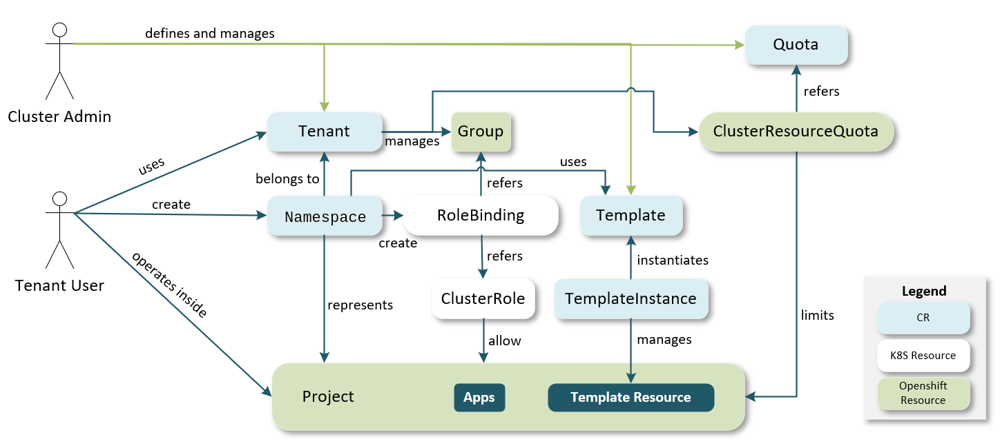

# Tenant Operator

## Overview

It enables cluster administrators to host multiple tenants in a single Stakater Agility Platform. i.e.

- enable to share managed applications to multiple tenants
- enable to share Openshift cluster to multiple tenants

**Why?**

Openshift and all managed applications provide enough primitives to accommodate multiple tenants but it requires professional skills and deep knowledge on them. It gives complexity to the users.

Tenant operator provides wrappers on them so users can use it easily at the higher abstract level.

Manage changes via PRs just like a typical workflow, so tenants can request changes; add new user or remove user.

Self-Service provisioning for tenants.

Tenant limits (Quota) to ensure quality of service and fairness when sharing a cluster.

Tenants & Tenant Users to separate tenants in a shared Kubernetes cluster.

## Custom Resources

- Tenant
- Quota
- Template
- TemplateInstance
- TemplateGroupInstance

#### Tenant CR

It specifies users list, quota name and  for the tenant.

``` yaml
apiVersion: tenantoperator.stakater.com/v1alpha1
kind: Tenant
metadata:
  name: development
spec:
  users:
    owner:
    - haseeb@stakater.com
    edit: 
    - hanzala@stakater.com
    view:
    - jose@stakater.com
  quota: development
  namespacetemplate:
    templateInstances:
    - spec:
        template: redis
      selector:
        matchLabels:
          app: redis
```

- Tenant CR has 3 kinds of users:
  - `Owner`: Are users who will be owners of a tenant. They will have openshift admin-role assigned to their users and they can also create namespaces.
  - `Edit`: Are user who will be editors of a tenant. They will have openshift edit-role assigned to their users.
  - `View`: Are user who will be viewers of a tenant. They will have openshift view-role assigned to their users.

  |Role|Description|
  | -- | -- |
  | owner | owner role on namespace + CRUDS on CRs in the namespace |
  | edit | edit role on namespace + CRUDS on CR in the namespace except Role and RoleBinding |
  | view | view role on namespace + RS on CR in the namespace |

- Tenant controller creates a `clusterresourcequotas.quota.openshift.io` object whose `spec` is same with the quota's specfied in `Tenant CR`.

- Tenant controller creates a `templateinstance` object whose `spec` is same as `template` mentioned in `namespacetemplate.templateInstances.spec.template` specfied in `Tenant CR`, `templateinstance` will only be applied in those `namespaces` which belong to that `tenant` and which have `matching label`.

#### Namespace

``` yaml
apiVersion: v1
kind: Namespace
metadata:
  labels:
    stakater.com/tenant: development
  name: build
```

- Namespace should have label `stakater.com/tenant` which contains the name of tenant to which it belongs to. The labels and annotationos specified in the operator config, `ocp.labels.project` and `ocp.annotations.project` are inserted in the namespace by the controller.

#### Quota CR

``` yaml
apiVersion: tenantoperator.stakater.com/v1alpha1
kind: Quota
metadata:
  name: development
  annotations:
    quota.tenantoperator.stakater.com/is-default: "false"
spec:
  hard:
    configmaps: "10"
    persistentvolumeclaims: "4"
    replicationcontrollers: "20"
    secrets: "10"
    services: "10"
    services.loadbalancers: "2"
```

It indicates the resource constraints which is referred to create `ClusterResourceQuota` that limit aggregate resource consumption per `Tenant`.

#### Template

```yaml
apiVersion: tenantoperator.stakater.com/v1alpha1
kind: Template
metadata:
  name: redis
resources:
  helm:
    releaseName: redis
    chart:
      repository:
        name: redis
        repoUrl: https://charts.bitnami.com/bitnami
    values: |
      redisPort: 6379
---
apiVersion: tenantoperator.stakater.com/v1alpha1
kind: Template
metadata:
  name: networkpolicy
resources:
  manifests:
    - kind: NetworkPolicy
      apiVersion: networking.k8s.io/v1
      metadata:
        name: deny-cross-ns-traffic
      spec:
        podSelector:
          matchLabels:
        ingress:
          - from:
              - podSelector: {}
```

Templates are used to initialize Namespaces and share common resources across namespaces (e.g. secrets).

- They either contains one or more Kubernetes manifests or alternatively a Helm chart.
- They are being tracked by TemplateInstances in each Namespace they are applied to.
- They can contain pre-defined parameters such as ${namespace} or user-defined ${MY_PARAMETER} that can be specified within an TemplateInstance.

Also you can define custom variables in `Template` and `TemplateInstace`. The parameters defined in `TemplateInstance` are overwritten the values defined in `Template`.

(1) Manifest Templates

The easiest option to define a Template is by specifying an array of Kubernetes manifests which should be applied when the Template is being instantiated.

(2) Helm Chart Templates

Instead of manifests, a Template can specify a Helm chart that will be installed (using helm template) when the Template is being instantiated.

(3) Mandatory vs. Optional Templates

Templates can either be mandatory or optional. By default, all Templates are optional. Cluster Admins can make Templates mandatory by adding them to the `spec.namespacetemplate.templateInstances` array within the Tenant configuration. All Templates listed in `spec.namespacetemplate.templateInstances` will always be instantiated within every `Namespace` that is created for the respective Tenant.

By adding `LabelSelector` in `spec.namespacetemplate.templateInstances.Selector` field, template can be instantiated within the matching `Namespaces` only.

#### TemplateGroupInstance

``` yaml
apiVersion: tenantoperator.stakater.com/v1alpha1
kind: TemplateGroupInstance
metadata:
  name: redis-instance
spec:
  template: redis
  tenant: development
  selector:
    matchLabels:
      app: redis
  sync: true
```

TemplateGroupInstance distributes template across multiple namespaces which are selected by labelSelector.
It specifies the matching labels and tenant name.

#### TemplateInstance

To keep track of resources created from Templates, TemplateInstance for each Template is being instantiated inside a Namespace.
Generally, a TemplateInstance is created from a Template and then, the TemplateInstances will not be updated when the Template changes later on. To change this behavior, it is possible to set `spec.sync: true` in a TemplateInstance. Setting this option, means to keep this TemplateInstance in sync with the underlying template (similar to helm upgrade).



## Notes

- `tenant.spec.users.owner`: Can only create *Namespaces* with required *tenant label* and can delete *Projects*. To edit *Namespace* use `GitOps/ArgoCD`
