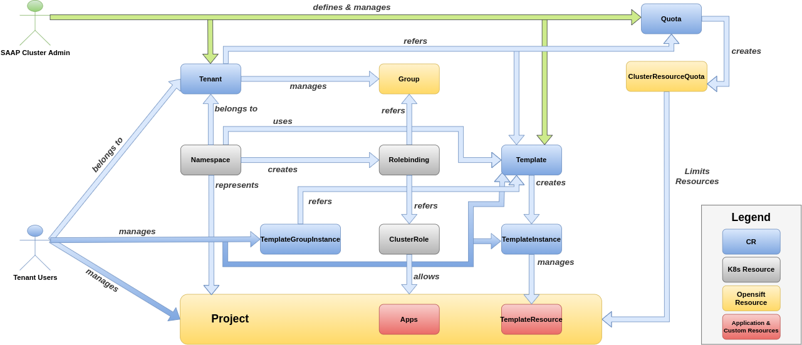
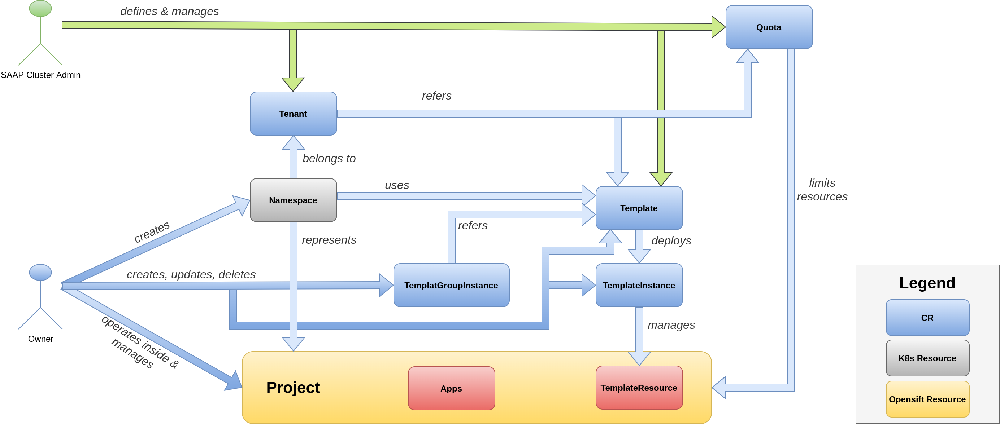
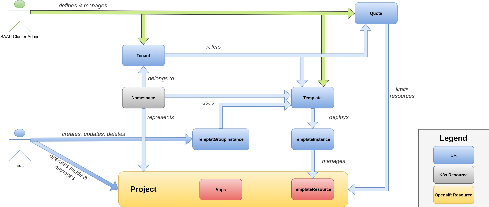
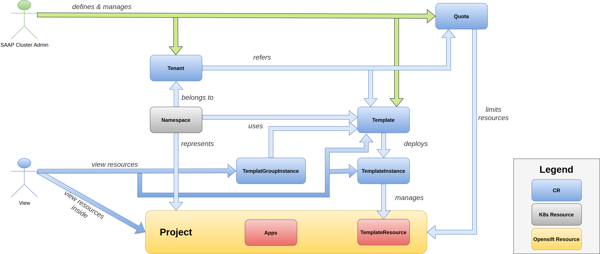

# Roles

## SAAP Cluster Admin

fig 1. Shows how SAAP Cluster Admin manages tenants using Tenant Operator

SAAP Cluster Admin are admins of a cluster. They are responsible for the configuration and maintainance of tenants and quotas. More more details [SAAP ClusterAdmin](https://docs.cloud.stakater.com/content/sre/authentication-authorization/saap-authorization-roles.html#_1-saap-cluster-admin-sca)

## Owner

fig 2. Shows how tenant owners manage there tenant using Tenant Operator

Owner role will have admin access on there `Projects` and they can also create new `namespaces`.

### Access Permissions

* Role and RoleBinding access in `Project` :
  * delete
  * create
  * list
  * get
  * update
  * patch

### Quotas Permissions

* LimitRange and ResourceQuota access in `Project`
  * get
  * list
  * watch

* Daemonset access in `Project`
  * create
  * delete
  * get
  * list
  * patch
  * update
  * watch

### Resources Permissions

* CRUD access on Template, TemplateInstance and TemplateGroupInstance of Tenant Operator custom resources
* CRUD access on ImageStreamTags in `Project`
* Get access on CustomResourceDefinitions in `Project`
* Get, list, watch access on Builds, BuildConfigs in `Project`
* CRUD access on following resources in `Project`:
  * Prometheuses
  * Prometheusrules
  * ServiceMonitors
  * PodMonitors
  * ThanosRulers
* Permission to create Namespaces.
* Restricted to perform actions on cluster resource Quotas and Limits.

*Owners will also inhert roles from `Edit` and `View`.

## Edit

fig 3. Shows editors role in a tenant using Tenant Operator

Editor role will have edit access on there `Projects`, but they wont have access on Roles or RoleBindings.

### Access Permissions

* ServiceAccount access in `Project`
  * create
  * delete
  * deletecollection
  * get
  * list
  * patch
  * update
  * watch
  * impersonate

### Quotas Permissions

* AppliedClusterResourceQuotas and ResourceQuotaUsages access in `Project`
  * get
  * list
  * watch

### Builds ,Pods , PVC Permissions

* Pod, PodDisruptionBudgets and PVC access in `Project`
  * get
  * list
  * watch
  * create
  * delete
  * deletecollection
  * patch
  * update
* Build, BuildConfig, Buildlog, DeploymentConfig, Deployment, ConfigMap, ImageStream , ImageStreamImage and ImageStreamMapping access in `Project`
  * get
  * list
  * watch
  * create
  * delete
  * deletecollection
  * patch
  * update

### Resources Permissions

* CRUD access on Template, TemplateInstance and TemplateGroupInstance of Tenant Operator custom resources
* Job, CronJob, Task, Trigger and Pipeline access in `Project`
  * get
  * list
  * watch
  * create
  * delete
  * deletecollection
  * patch
  * update
* Get access on projects
* Route and NetworkPolicies access in `Project`
  * get
  * list
  * watch
  * create
  * delete
  * deletecollection
  * patch
  * update
* Template, ReplicaSet, StatefulSet and DaemonSet access in `Project`
  * get
  * list
  * watch
  * create
  * delete
  * deletecollection
  * patch
  * update
* CRUD access on all Projects related to
  * Elasticsearch
  * Logging
  * Kibana
  * Istio
  * Jaeger
  * Kiali
  * Tekton.dev
* Get access on customresourcedefinitions in `Project`
* Edit and view permission on jenkins.build.openshift.io
* InstallPlan access in `Project`
  * get
  * list
  * watch
  * delete

* Subscription and PackageManifest access in `Project`
  * get
  * list
  * watch
  * create
  * delete
  * deletecollection
  * patch
  * update

*Edit will also inhert `View` role.
## View

fig 4. Shows viewers role in a tenant using Tenant Operator

Viewer role will only have view access on there `Project`.

### Access Permissions 

* ServiceAccount access in `Project`
  * get
  * list
  * watch

### Quotas Permissions

* AppliedClusterResourceQuotas access in `Project`
  * get
  * list
  * watch

### Builds ,Pods , PVC Permissions

* Pod, PodDisruptionBudget and PVC access in `Project`
  * get
  * list
  * watch
* Build, BuildConfig, BuildLog, DeploymentConfig, ConfigMap, ImageStream, ImageStreamImage and ImageStreamMapping access in `Project`
  * get
  * list
  * watch

### Resources Permissions

* Get, list, view access on Template, TemplateInstance and TemplateGroupInstance of Tenant Operator custom resources
* Job, CronJob, Task, Trigger and Pipeline access in `Project`
  * get
  * list
  * watch
* Get access on projects
* Routes, NetworkPolicies and Daemonset access in `Project`
  * get
  * list
  * watch
* Template, ReplicaSet, StatefulSet and Daemonset in `Project`
  * get
  * list
  * watch
* Get,list,watch access on all projects related to
  * Elasticsearch
  * Logging
  * Kibana
  * Istio
  * Jaeger
  * Kiali
  * Tekton.dev
* Get, list, watch access on ImageStream, ImageStreamImage and ImageStreamMapping in `Project`
* Get access on CustomResourceDefinition in `Project`
* View permission on Jenkins.Build.Openshift.io
* Subscription, PackageManifest and InstallPlan access in `Project`
  * get
  * list
  * watch
