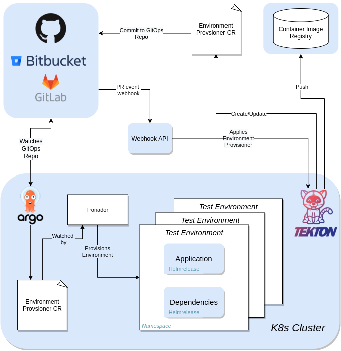

# Overview

Environment-as-a-Service; Dynamic test environments on Kubernetes on demand!

Traditionally, many software development projects merge changes from developers into the repository, and then identify regressions resulting from those changes, followed by more patches to fix those bugs.

To prevent changes that introduce regressions from being merged, changes should be confirmed to work without disruption before they merged.

Tronador provides testing environments so the changes can be tested in the same environment with the production. The testing environments are aligned with the codebase and provisioned on Openshift or Kubernetes.

Tronador enables teams to have separate isolated testing environments per project easily in declarative way and enables multiple teams to collaborate on complex application stacks respecting their own revisions.

## How it works

Tronador is a utility designed to provision and manage a dynamic testing environment for applications. Tronador will provision an environment within your cluster in a specific namespace, and then deploy your application to that namespace. This is done by deploying a Helm release in the namespace, which will then create a deployment that manages the application's pods. This provides a way to test the application without having to manually deploy everything by yourself, allowing the developer/tester to save valuable time.

## Architecture

Tronador comes with a CRD and a Tekton cluster task. The CRD, `EnvironmentProvisioner` , will be used for creating the environment within your cluster. The Tekton cluster task, `create-environment-provisioner` , will be used for automatically creating the `EnvironmentProvisioner` Custom Resource. The task depends on a [Tronador config file](./config_file.html) to be created in your repository, which will be used to create the CR. The `create-environment-provisioner` task can be used within your own Tekton pipeline, automating the process of creating and deploying the image of your application after changes are made to it. An example of a pipeline doing this would be:

1. A webhook is created when a PR is opened, and the pipeline containing the `create-environment-provisioner` task is triggered.
2. The pipeline will first create an image and push it to your container image registry.
3. The pipeline will then create or update the `EnvironmentProvisioner` CR using that image.
4. The CR will be pushed to your GitOps repository.
5. ArgoCD will watch the GitOps repository for changes and synchronize any changes, like the `EnvironmentProvisioner` CR, to the cluster.
6. The `EnvironmentProvisioner` CR will be watched by the `Tronador` Operator.
7. Tronador will create a test environment for the application, by creating a HelmRelease for your application and external dependencies inside that environment

## Dependencies
- **Helm Operator**: Tronador requires the Helm Operator to be installed in your cluster. The Helm Operator is a Kubernetes operator that manages the lifecycle of Helm releases. Tronador's `EnvironmentProvisioner` Custom Resource creates helm releases that are managed by the Helm Operator.
