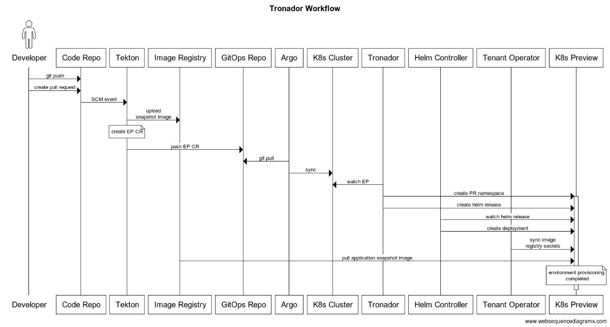
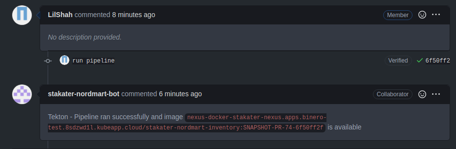
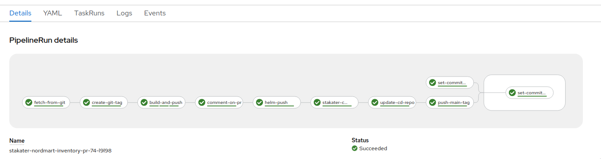
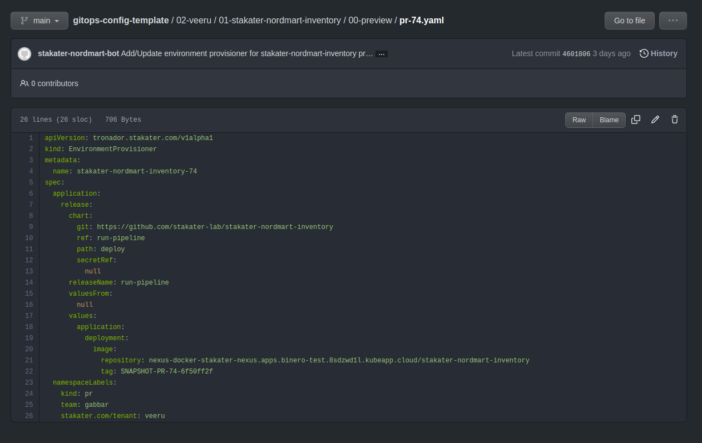
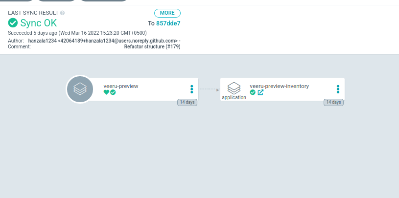

# Workflow guide for Tronador

::: warning Note:

The guide below is written as a SAAP customer's point of view. If you use Tronador independently, the guide below might not be applicable to you. However, you can still use this guide to get an idea of how the process works.

:::

For tronador to work, you need to add support for it in your Git Repository by adding a [Tronador config file](./config_file.html). Afterwards, a Tekton pipeline needs to be setup with the [Tronador cluster task](./cluster_task.html), and a cluster task that pushes the output EP to your gitops repository. Test environments should then be created automatically every time a PR is created or updated. The entire Dynamic Test Environment (DTE) creation process is described below.


<figure>
  
  <figcaption>Tronador Workflow</figcaption>
</figure>

### Tronador config file

The [Tronador config file](./config_file.html) is placed in the github repository and is used to configure the EnvironmentProvisioner CR. Environment Provisioning will only work if the config file exists.

```yaml
application:
  chart_path: deploy
  namespaceLabels:
    kind: pr
    team: gabbar
    stakater.com/tenant: veeru
  value_overrides:
    application:
      deployment:
        image:
          repository: {{APPLICATION_IMAGE_NAME}}
          tag: {{APPLICATION_IMAGE_TAG}}
```

### Github Event
 Github (or any other repository management system) events are used to trigger the Tronador pipeline. The pipeline is triggered whenever a PR is opened for a repository that supports tronador.

### Tekton Pipeline

The Tekton Pipeline needs to watch your repo where tronador is configured to be used, and when a PR is created or updated, it will trigger the Tekton pipeline. The pipeline will first create a docker image from the changes in your PR. It will then create an EnvironmentProvisioner CR by using the details in the config file, and replacing its `APPLICATION_IMAGE_NAME` and `APPLICATION_IMAGE_TAG` variables in the config file with the details about the created docker image. Finally it will push the Environment Provisioner to your gitops repository.

<figure>
  
  <figcaption>Created docker image</figcaption>
</figure>

<br>

<figure>
  
  <figcaption>A successful pipeline run</figcaption>
</figure>

### GitOps Repository

A successful pipeline run will create a new Environment Provisioner CR, and push it to your gitops repository.

<figure>
  
  <figcaption>Environment Provisioner pushed</figcaption>
</figure>

### ArgoCD push

ArgoCD is a tool that can be used to watch a repo and push the changes to your cluster. In this case, it will push the Environment Provisioner CR from your gitops repository to your cluster.

<figure>
  
  <figcaption>Relevant ArgoCD Application synced</figcaption>
</figure>

### Environment Provisioner

The EnvironmentProvisioner Custom Resource does the actual work of creating the test environment. It is responsible for creating the test environment, and for updating it when the image is updated. The process for this is to first create a namespace, then create a helm release within the namespace using details about the image to be deployed. These details are gotten from the pipeline and the tronador config file.

```yaml
apiVersion: tronador.stakater.com/v1alpha1
kind: EnvironmentProvisioner
metadata:
  name: stakater-nordmart-inventory-74
spec:
  application:
    release:
      chart:
        git: 'https://github.com/stakater-lab/stakater-nordmart-inventory'
        path: deploy
        ref: run-pipeline
      releaseName: run-pipeline
      values:
        application:
          deployment:
            image:
              repository: >-
                nexus-docker-stakater-nexus.apps.binero-test.8sdzwd1l.kubeapp.cloud/stakater-nordmart-inventory
              tag: SNAPSHOT-PR-74-6f50ff2f
  namespaceLabels:
    kind: pr
    stakater.com/tenant: veeru
    team: gabbar
status:
  applicationStatus: deployed
  applicationStatusMsg: >-
    Release was successful for Helm release 'run-pipeline' in
    'stakater-nordmart-inventory-74'.
  currentPhase: Waiting For Next Reconciliation Loop
  namespaceLabels:
    kind: pr
    stakater.com/tenant: veeru
    team: gabbar
```

### Helm Release

Helm Releases are watched by the Helm Operator, which manages the creation of all resources listed in a referenced helm chart. This chart is usually placed within the repo itself, and in this case tronador passes along the reference to this chart from the Environment Provisioner to the Helm Release. The only thing that is changed is the image to be deployed, which is passed along from the pipeline with each update to the PR and updated within the helm release automatically.

```yaml
apiVersion: helm.fluxcd.io/v1
kind: HelmRelease
metadata:
  name: run-pipeline
  namespace: stakater-nordmart-inventory-74
  labels:
    app.kubernetes.io/instance: run-pipeline
    app.kubernetes.io/managed-by: tronador.stakater.com
spec:
  chart:
    git: 'https://github.com/stakater-lab/stakater-nordmart-inventory'
    path: deploy
    ref: run-pipeline
  releaseName: run-pipeline
  rollback: {}
  test: {}
  values:
    application:
      deployment:
        image:
          repository: >-
            nexus-docker-stakater-nexus.apps.binero-test.8sdzwd1l.kubeapp.cloud/stakater-nordmart-inventory
          tag: SNAPSHOT-PR-74-6f50ff2f
status:
  conditions:
    - lastTransitionTime: '2022-03-21T11:46:19Z'
      lastUpdateTime: '2022-03-21T11:46:19Z'
      message: >-
        Chart fetch failed for Helm release 'run-pipeline' in
        'stakater-nordmart-inventory-74'.
      reason: ChartFetchFailed
      status: 'False'
      type: ChartFetched
    - lastTransitionTime: '2022-03-21T11:46:40Z'
      lastUpdateTime: '2022-03-21T11:46:40Z'
      message: >-
        Installation or upgrade succeeded for Helm release 'run-pipeline' in
        'stakater-nordmart-inventory-74'.
      reason: Deployed
      status: 'True'
      type: Deployed
    - lastTransitionTime: '2022-03-21T11:46:40Z'
      lastUpdateTime: '2022-03-21T11:48:01Z'
      message: >-
        Release was successful for Helm release 'run-pipeline' in
        'stakater-nordmart-inventory-74'.
      reason: Succeeded
      status: 'True'
      type: Released
  lastAttemptedRevision: 6f50ff2ff844f5f7c2b6627e3d7319e4717ac847
  observedGeneration: 1
  phase: Succeeded
  releaseName: run-pipeline
  releaseStatus: deployed
  revision: 6f50ff2ff844f5f7c2b6627e3d7319e4717ac847
```

### Secrets management

Secrets for the helm chart to be deployed are currently passed along from the tronador config file, to the helm release. 
Secrets for helm chart and other required resources like image pull secret can be brought into Environment Provisioner owned namespaces using [Tronador Config](./tronador_config.html) CR. 

You can also use [Tenant Operator's](../tenant-operator/overview.html) [TemplateGroupInstance](../tenant-operator/customresources.html#_5-templategroupinstance) to pass secrets to the namespace that will be provisioned by the EnvironmentProvisioner by setting the proper label in your tronador config file. An example for this workflow is [provided here](../tenant-operator/usecases/deploying-templates.html#deploying-template-to-namespaces-via-templategroupinstances).

### Application snapshot deployed

After the entire above process is completed, the Helm Release will create a deployment that will deploy the pods for the application and its changes mentioned in the PR to the namespace created by the Environment Provisioner.